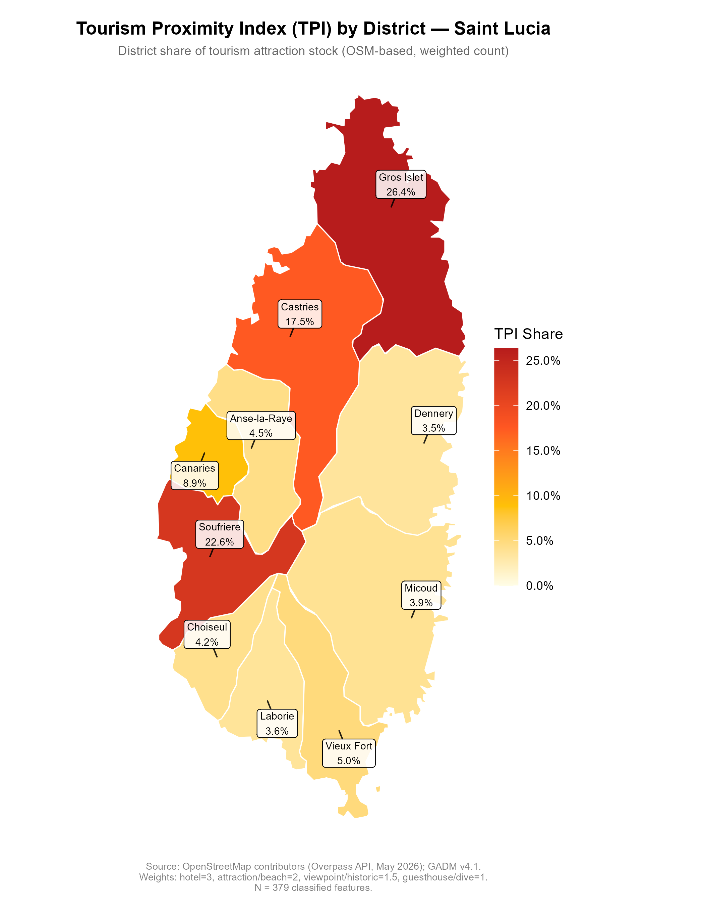

\newpage

# Abstract

This study investigates whether Airbnb's entry into Saint Lucia has negatively affected local housing affordability through rental displacement, rent inflation, housing stock conversion, and increased household crowding. Using a shift-share instrumental variable design with census data from 2010 and 2022, alongside tourism arrival data from Saint Lucia's Central Statistics Office, the study examines how pre-existing tourism exposure shaped local housing outcomes. The results indicate that high-tourism districts experienced sharp declines in renter-occupied tenure, rising homeownership among remaining residents, and substantially higher rents for the renters who stayed. These patterns are consistent with a displacement and sorting mechanism: short-term rental conversion reduces the supply of long-term rental housing, pricing out lower-income renters who relocate to peripheral districts, while tourism-driven property appreciation attracts wealthier owner-occupiers into vacated units. Overall, the findings suggest that Airbnb's expansion since 2014 has restructured the tenure composition of Saint Lucia's most tourism-intensive districts, with affordability costs borne disproportionately by displaced renters.

\newpage

# Data Sources and Processing

## Overview of All Available Data

```{r setup}
library(haven)
library(tidyverse)
library(labelled)
library(knitr)
library(scales)
library(ggrepel)
library(fixest)
library(modelsummary)

theme_set(
  theme_minimal(base_size = 10) +
    theme(
      plot.title    = element_text(face = "bold", size = 11),
      plot.subtitle = element_text(size = 9, color = "grey40"),
      plot.caption  = element_text(size = 7, color = "grey50"),
      axis.text     = element_text(size = 8),
      legend.position = "bottom",
      legend.text   = element_text(size = 8)
    )
)
```

```{r table-all-datasources}
tibble(
  `Data Source` = c(
    "2010 Population & Housing Census",
    "2022 Population & Housing Census",
    "2022 Building Enumeration File (IDDetail)",
    "Tourism Proximity Index (TPI)",
    "CSO Tourism Statistics",
    "Google Trends — Airbnb",
    "AirROI STR Market Data (2025–2026)",
    "Tom Slee Airbnb Scrape (2016–2017)"
  ),
  File = c(
    "person_house_merged.sav",
    "PersonHHoldMerge 2022 Annon.sav",
    "IDDetail_Merged_Anon.sav",
    "TPI_v2_attraction_concentration.csv",
    "Selected-Tourism-Statistics.csv",
    "google_trends_Airbnb.csv",
    "Web (AirROI.com)",
    "Web (tomslee.net)"
  ),
  `Unit of Observation` = c(
    "Household (person-household merged)",
    "Household (person-household merged)",
    "Building",
    "District",
    "National annual",
    "Global monthly",
    "District / sub-area",
    "Listing"
  ),
  `Key Variables` = c(
    "Tenure (H13_OWN), bedrooms, household size, weight",
    "Tenure (h2_3a), rent (h2_3b1), bedrooms, foreign visitors, weight",
    "Building type (Dwell_Bldg), vacancy count, dwelling count",
    "TPI share per district (Bartik IV share)",
    "Annual stay-over arrivals 2010–2022",
    "Monthly worldwide search interest index",
    "Active listing counts by district, 2025–2026",
    "Listing counts island-wide, Sept 2016 – July 2017"
  ),
  `Status` = c(
    "Available",
    "Available",
    "Available",
    "Available",
    "Available",
    "Available",
    "Available (current only)",
    "Available (2016–2017 only)"
  )
) |>
  kable(caption = "Table 1. Complete inventory of available data sources.")
```

## Census Microdata (2010 and 2022)

The primary data source is the Saint Lucia Population and Housing Census, with complete waves in 2010 (pre-Airbnb) and 2022 (post-Airbnb). Microdata was obtained from the Central Statistical Office and aggregated to the district level.

```{r table-census-comparison}
tibble(
  Feature = c(
    "Source", "Coverage", "Unit of observation",
    "Sample (households)", "Tenure variable",
    "Rent variable", "Bedrooms", "Household weight",
    "Foreign visitors", "Building vacancy"
  ),
  `2010 Census` = c(
    "CSO Saint Lucia person–household merged file",
    "Full population census",
    "Person (merged with household record)",
    "50,241",
    "H13_OWN (9 categories)",
    "Not collected",
    "H24_BEDROOMS",
    "HWEIGHT",
    "Not collected",
    "Not collected"
  ),
  `2022 Census` = c(
    "CSO Saint Lucia PersonHHoldMerge (Anon.)",
    "Full population census",
    "Person (merged with household record)",
    "50,588",
    "h2_3a (12 categories)",
    "h2_3b1 (EC$/month)",
    "h2_15",
    "HHLD_WEIGHT",
    "Foreign (count per household)",
    "IDDetail: num_vacant_bldg / num_dwell_bldg"
  )
) |>
  kable(caption = "Table 2. Census data source comparison.")
```

### Tenure Harmonisation

Tenure status is harmonised across years to ensure comparability:

| Category | 2010 (H13_OWN) | 2022 (h2_3a) |
|---|---|---|
| Owner-occupied | 1 (Owned fully), 2 (Mortgage) | 1–3 (Owned fully), 4–6 (Mortgage) |
| Renter | 3 (Private), 4 (Govt) | 7 (Private), 8 (Govt) |
| Rent-free | 5 | 9 |

### Building-Level Vacancy (IDDetail)

The 2022 IDDetail building enumeration file (`IDDetail_Merged_Anon.sav`) records, for each building: total dwelling units (`num_dwell_bldg`), occupied households (`num_hh_bldg`), and vacant units (`num_vacant_bldg`). Aggregated to the district level, the **vacancy rate** (vacant units / total dwelling units) proxies housing stock removed from long-term residential use — a key indicator of STR conversion.

## Tourism Proximity Index (TPI)

The **TPI** is the Bartik IV share: each district's share of Saint Lucia's total weighted tourism attraction stock, constructed from OpenStreetMap (OSM) point-of-interest data queried via the Overpass API (May 2026). A total of 379 classified features contribute to an island-wide weighted score of 701. Feature weights reflect anchor importance: hotels/resorts (3), formal attractions and beaches (2), viewpoints and historic sites (1.5), guesthouses and dive centres (1).

```{r load-tpi}
tpi_data <- read.csv("TPI_v2_attraction_concentration.csv") |>
  select(district, tpi = tpi_v2)
```

```{r table-tpi}
tpi_data |>
  arrange(desc(tpi)) |>
  mutate(
    tpi_pct = paste0(round(tpi * 100, 1), "%"),
    tourism_tier = case_when(
      tpi >= 0.20 ~ "High",
      tpi >= 0.09 ~ "Medium",
      TRUE        ~ "Low"
    )
  ) |>
  select(District = district, `TPI Share` = tpi_pct, Tier = tourism_tier) |>
  kable(caption = "Table 3. Tourism Proximity Index (TPI) by district. Source: OpenStreetMap / Overpass API (May 2026); GADM v4.1.")
```

```{r fig-tpi-map, fig.cap="Figure 2. Tourism Proximity Index (TPI) by District, Saint Lucia. Each district's share of the island's weighted tourism attraction stock, used as the Bartik IV share to instrument for Airbnb penetration. Gros Islet, Soufriere, and Castries account for roughly two-thirds of all attraction weight. Source: OpenStreetMap / Overpass API (May 2026); GADM v4.1.", fig.width=5, fig.height=6.5, fig.align='center'}

```

## National Tourism Shift

Three shift variants are used to construct the Bartik instrument, differing in how the national-level growth component is measured.

### Shift 1: CSO Stay-Over Arrivals

The first shift is the growth in island-wide stay-over arrivals from the pre-Airbnb average (2010–2014) to the post-launch average (2015–2019 and 2022). Pandemic years 2020–2021 are excluded because COVID-19 collapsed arrivals by roughly 70%, which would otherwise suppress the post-period mean and understate the Airbnb-era expansion. This shift proxies tourism demand pressure.

| Period | Years | Mean Arrivals |
|---|---|---|
| Pre-Airbnb | 2010–2014 | 316,385 |
| Post-launch | 2015–2019, 2022 | 375,610 |
| **Arrivals shift** | | **+18.7% (Δg = 0.187)** |

### Shift 2: Google Trends Search Interest

The second shift uses worldwide Google Trends search interest for "Airbnb" (scale 0–100, sourced from `google_trends_Airbnb.csv`) to capture global platform awareness and adoption. Unlike the arrivals shift, which reflects tourism demand, this shift proxies supply-side expansion driven by platform growth — the degree to which hosts globally became aware of and listed on Airbnb. The same pre- and post-period averages are applied, with pandemic years excluded.

| Period | Years | Mean Index |
|---|---|---|
| Pre-Airbnb | 2010–2014 | 7.8 |
| Post-launch | 2015–2019, 2022 | 64.5 |
| **Google Trends shift** | | **+732% (Δg = 7.32)** |

### Shift 3: Combined (Geometric Mean)

A third combined shift is constructed as the geometric mean of the arrivals and Google Trends shifts: $\Delta g^{\text{combined}} = \sqrt{0.187 \times 7.32} \approx 1.17$. The geometric mean is appropriate because the two forces are multiplicatively complementary — STR displacement is greatest when both platform adoption and tourist demand are simultaneously high. All three shift variants are estimated in the regression analysis.

## Short-Term Rental Listing Data

District-level STR listing counts for 2022 have been formally requested from the CSO and SLTA; receipt is pending. As contextual evidence, publicly available sources provide the following:

```{r table-str-context}
tibble(
  Source = c(
    "Tom Slee scrape (Sept 2016)",
    "Tom Slee scrape (July 2017)",
    "Airbtics (March 2026)",
    "AirROI — Castries (2025–2026)",
    "AirROI — Soufrière (2025–2026)",
    "AirROI — Gros Islet sub-areas (2025–2026)",
    "AirROI — Vieux Fort (2025–2026)"
  ),
  `Listing Count` = c(
    "642 (island-wide)",
    "835 (island-wide)",
    "1,511 (island-wide)",
    "223 (Castries, Coolie Town, Balata)",
    "120 (Soufrière town) + 19 (Fond Saint Jacques)",
    "46 (Corinth) + 21 (Grande Rivière) + 18 (Cap Estate)",
    "43"
  ),
  Notes = c(
    "Earliest available; pre-census baseline",
    "Pre-census; shows rapid early growth",
    "Current; confirms geographic concentration",
    "Highest-TPI district dominates",
    "Second-highest TPI district",
    "Partial sub-area counts only",
    "Smaller southern market"
  )
) |>
  kable(caption = "Table 4. Available STR listing count data. 2022 district-level counts pending CSO/SLTA response.")
```

The geographic concentration of listings — Castries and Gros Islet/Soufrière together accounting for the large majority — closely mirrors the TPI distribution, providing external validation of the instrument.

\newpage

# Methodology

## Data Loading and Processing

```{r load-data}
raw_2022 <- read_sav("PersonHHoldMerge 2022 Annon.sav")

hh_2022 <- raw_2022 |>
  distinct(CompositeKey, .keep_all = TRUE) |>
  select(CompositeKey, DISTRICT_ID, Npersons,
         h2_3a, h2_3b1, h2_15, HHLD_WEIGHT) |>
  rename(
    household_id   = CompositeKey,
    district_id    = DISTRICT_ID,
    household_size = Npersons,
    tenure         = h2_3a,
    monthly_rent   = h2_3b1,
    bedrooms       = h2_15,
    hh_weight      = HHLD_WEIGHT
  ) |>
  zap_labels() |>
  mutate(
    across(c(tenure, monthly_rent, bedrooms, household_size),
           ~ if_else(. %in% c(-999999999, 999999999), NA_real_, as.numeric(.))),
    district = case_when(
      district_id %in% 1:3 ~ "Castries",
      district_id == 4     ~ "Anse-la-Raye",
      district_id == 5     ~ "Canaries",
      district_id == 6     ~ "Soufriere",
      district_id == 7     ~ "Choiseul",
      district_id == 8     ~ "Laborie",
      district_id == 9     ~ "Vieux Fort",
      district_id == 10    ~ "Micoud",
      district_id == 11    ~ "Dennery",
      district_id == 12    ~ "Gros Islet",
      TRUE ~ NA_character_
    ),
    owner    = if_else(tenure %in% 1:6, 1, 0),
    renter   = if_else(tenure %in% 7:8, 1, 0),
    rentfree = if_else(tenure == 9,     1, 0),
    persons_per_bedroom = if_else(bedrooms > 0, household_size / bedrooms, NA_real_)
  ) |>
  filter(!is.na(district))

raw_2010 <- read_sav("person_house_merged.sav")

hh_2010 <- raw_2010 |>
  mutate(household_id_2010 = paste(DISTRICT, ED, HH, sep = "_")) |>
  distinct(household_id_2010, .keep_all = TRUE) |>
  select(household_id_2010, DISTRICT, NPERS, H13_OWN, H24_BEDROOMS, HWEIGHT) |>
  rename(
    household_id   = household_id_2010,
    district_id    = DISTRICT,
    household_size = NPERS,
    tenure         = H13_OWN,
    bedrooms       = H24_BEDROOMS,
    hh_weight      = HWEIGHT
  ) |>
  zap_labels() |>
  mutate(
    across(c(tenure, bedrooms, household_size),
           ~ if_else(. %in% c(-999999999, 999999999), NA_real_, as.numeric(.))),
    persons_per_bedroom = if_else(bedrooms > 0, household_size / bedrooms, NA_real_),
    district = case_when(
      district_id %in% 1:3 ~ "Castries",
      district_id == 4     ~ "Anse-la-Raye",
      district_id == 5     ~ "Canaries",
      district_id == 6     ~ "Soufriere",
      district_id == 7     ~ "Choiseul",
      district_id == 8     ~ "Laborie",
      district_id == 9     ~ "Vieux Fort",
      district_id == 10    ~ "Micoud",
      district_id == 11    ~ "Dennery",
      district_id == 12    ~ "Gros Islet",
      TRUE ~ NA_character_
    ),
    owner    = if_else(tenure %in% c(1, 2), 1, 0),
    renter   = if_else(tenure %in% c(3, 4), 1, 0),
    rentfree = if_else(tenure == 5, 1, 0)
  ) |>
  filter(!is.na(district))
```

```{r district-summaries}
district_2022 <- hh_2022 |>
  filter(!is.na(hh_weight)) |>
  group_by(district) |>
  summarise(
    renter_rate_22       = weighted.mean(renter,              hh_weight, na.rm = TRUE),
    owner_rate_22        = weighted.mean(owner,               hh_weight, na.rm = TRUE),
    rentfree_rate_22     = weighted.mean(rentfree,            hh_weight, na.rm = TRUE),
    hh_size_22           = weighted.mean(household_size,      hh_weight, na.rm = TRUE),
    ppbr_22              = weighted.mean(persons_per_bedroom, hh_weight, na.rm = TRUE),
    .groups = "drop"
  )

district_2010 <- hh_2010 |>
  filter(!is.na(hh_weight)) |>
  group_by(district) |>
  summarise(
    renter_rate_10   = weighted.mean(renter,              hh_weight, na.rm = TRUE),
    owner_rate_10    = weighted.mean(owner,               hh_weight, na.rm = TRUE),
    rentfree_rate_10 = weighted.mean(rentfree,            hh_weight, na.rm = TRUE),
    hh_size_10       = weighted.mean(household_size,      hh_weight, na.rm = TRUE),
    ppbr_10          = weighted.mean(persons_per_bedroom, hh_weight, na.rm = TRUE),
    .groups = "drop"
  )
```

```{r shifts}
tourism_raw <- read.csv("Selected-Tourism-Statistics.csv",
                        header = FALSE, stringsAsFactors = FALSE)
stay_annual <- tourism_raw |>
  setNames(paste0("V", seq_len(ncol(tourism_raw)))) |>
  filter(grepl("Stay-Over Arrivals", V2, fixed = TRUE)) |>
  mutate(
    year   = as.integer(substr(trimws(V5), 1, 4)),
    amount = as.numeric(gsub(",", "", trimws(V6)))
  ) |>
  filter(!is.na(year), !is.na(amount)) |>
  group_by(year) |>
  summarise(arrivals = sum(amount), .groups = "drop")

pre_avg        <- mean(stay_annual$arrivals[stay_annual$year %in% 2010:2014])
post_avg       <- mean(stay_annual$arrivals[stay_annual$year %in% c(2015:2019, 2022)])
national_shift <- (post_avg - pre_avg) / pre_avg

gt_raw   <- read.csv("google_trends_Airbnb.csv", header = TRUE, stringsAsFactors = FALSE)
colnames(gt_raw) <- c("date", "index")
gt_raw$year  <- as.integer(substr(trimws(gt_raw$date), 1, 4))
gt_raw$index <- suppressWarnings(as.numeric(gt_raw$index))
gt_annual <- aggregate(index ~ year,
                       data = gt_raw[!is.na(gt_raw$year) & !is.na(gt_raw$index), ],
                       FUN  = mean)
gt_pre   <- mean(gt_annual$index[gt_annual$year %in% 2010:2014])
gt_post  <- mean(gt_annual$index[gt_annual$year %in% c(2015:2019, 2022)])
gt_shift <- (gt_post - gt_pre) / gt_pre

combined_shift <- sqrt(gt_shift * national_shift)
```

```{r master-panel}
district_wide <- district_2010 |>
  left_join(district_2022, by = "district") |>
  left_join(tpi_data,      by = "district") |>
  mutate(
    d_renter  = (renter_rate_22 - renter_rate_10) * 100,
    d_owner   = (owner_rate_22  - owner_rate_10)  * 100,
    d_hh_size = hh_size_22 - hh_size_10,
    d_ppbr    = ppbr_22    - ppbr_10,
    tourism_tier = case_when(
      tpi >= 0.20 ~ "High",
      tpi >= 0.09 ~ "Medium",
      TRUE        ~ "Low"
    )
  )

panel <- bind_rows(
  district_2010 |>
    left_join(tpi_data, by = "district") |>
    mutate(year = 2010, post = 0,
           renter_rate   = renter_rate_10,
           owner_rate    = owner_rate_10,
           rentfree_rate = rentfree_rate_10,
           hh_size       = hh_size_10,
           ppbr          = ppbr_10),
  district_2022 |>
    left_join(tpi_data, by = "district") |>
    mutate(year = 2022, post = 1,
           renter_rate   = renter_rate_22,
           owner_rate    = owner_rate_22,
           rentfree_rate = rentfree_rate_22,
           hh_size       = hh_size_22,
           ppbr          = ppbr_22)
) |>
  mutate(
    tpi_post          = tpi * national_shift * post,
    tpi_post_gt       = tpi * gt_shift       * post,
    tpi_post_combined = tpi * combined_shift  * post
  )
```

## Identification Strategy: Bartik Shift-Share IV

The study uses a **Bartik (shift-share) instrumental variable** design. Airbnb's national expansion after 2014 was a common shock to all districts, but its local impact was proportional to each district's pre-existing share of Saint Lucia's tourism activity. Figure 1 below presents the causal structure as a Directed Acyclic Graph (DAG).

```{r fig-dag, fig.cap="DAG of the Bartik shift-share identification strategy. The instrument Z (TPI x Dg x Post) satisfies the exclusion restriction by affecting housing outcomes only through STR penetration. Grey = exogenous instruments; blue = endogenous treatment; red = outcome; orange = unobserved confounder. Dashed arrows indicate unobserved confounding paths.", fig.height=4, fig.width=7}
dag_nodes <- tibble(
  id    = c("TPI", "DeltaG", "Z", "D", "Y", "U"),
  label = c(
    "Tourism Proximity\nIndex (TPI)",
    "National Tourism\nGrowth (Dg)",
    "Bartik IV\n(TPI x Dg x Post)",
    "STR\nPenetration",
    "Housing Outcomes\n(Renter Rate, Rent)",
    "Unobserved\nConfounders"
  ),
  x    = c(0, 0, 3, 6, 9, 7.5),
  y    = c(1.2, -1.2, 0, 0, 0, 2.0),
  role = c("Instrument", "Instrument", "Instrument",
           "Treatment", "Outcome", "Confounder")
)

dag_edges <- tibble(
  from  = c("TPI",   "DeltaG", "Z",     "D",     "U",      "U"),
  to    = c("Z",     "Z",      "D",     "Y",     "D",      "Y"),
  ltype = c("solid", "solid",  "solid", "solid", "dashed", "dashed")
) |>
  left_join(dag_nodes |> select(id, x, y), by = c("from" = "id")) |>
  rename(x0 = x, y0 = y) |>
  left_join(dag_nodes |> select(id, x, y), by = c("to"   = "id")) |>
  rename(x1 = x, y1 = y)

ggplot() +
  geom_segment(
    data      = dag_edges,
    aes(x = x0, y = y0, xend = x1, yend = y1, linetype = ltype),
    arrow     = arrow(length = unit(0.2, "cm"), type = "closed"),
    color     = "grey30",
    linewidth = 0.6
  ) +
  geom_label(
    data          = dag_nodes,
    aes(x = x, y = y, label = label, fill = role),
    color         = "white",
    size          = 2.5,
    fontface      = "bold",
    lineheight    = 0.9,
    label.size    = 0.4,
    label.r       = unit(0.25, "lines"),
    label.padding = unit(0.3,  "lines")
  ) +
  scale_fill_manual(
    values = c(Instrument = "grey55", Treatment = "#2C7BB6",
               Outcome    = "#D7191C", Confounder = "#FDAE61"),
    name   = NULL
  ) +
  scale_linetype_manual(
    values = c(solid = "solid", dashed = "dashed"),
    labels = c(solid = "Observed causal path", dashed = "Unobserved confounding"),
    name   = NULL
  ) +
  xlim(-1.5, 10.5) +
  ylim(-2.5,  3.0) +
  labs(
    title    = "Figure 1. DAG: Bartik Shift-Share IV Identification Strategy",
    subtitle = "Dashed arrows = unobserved confounding (U); no direct IV to Outcome path (exclusion restriction)"
  ) +
  theme_void(base_size = 10) +
  theme(
    plot.title      = element_text(face = "bold", size = 11),
    plot.subtitle   = element_text(size = 9, color = "grey40"),
    legend.position = "bottom",
    legend.text     = element_text(size = 8)
  ) +
  guides(
    fill     = guide_legend(order = 1, override.aes = list(color = NA)),
    linetype = guide_legend(order = 2)
  )
```

$$Z_{dt} = \underbrace{TPI_d}_{\text{Share}} \times \underbrace{\Delta g_t^{\text{national}}}_{\text{Shift}}$$

**Reduced-form specification** (estimated currently; pending STR listing data for first stage):

$$Y_{dt} = \alpha + \beta^{RF}(TPI_d \times \Delta g^{\text{national}} \times \text{Post}_t) + \gamma_d + \delta_t + \varepsilon_{dt}$$

**First stage** (to be estimated once district-level STR listing counts are received):

$$\text{STR}_{dt} = \alpha + \pi(TPI_d \times \Delta g^{\text{national}} \times \text{Post}_t) + \gamma_d + \delta_t + u_{dt}$$

**2SLS second stage:** $\beta^{IV} = \beta^{RF} / \hat{\pi}$

Three shift variants are estimated:

- **Model 1 (GT Shift):** Δg = 7.32 (worldwide Google Trends growth for "Airbnb")
- **Model 2 (Arrivals Shift):** Δg = 0.187 (Saint Lucia stay-over arrivals growth)
- **Model 3 (Combined):** Δg = 1.17 (geometric mean of Shifts 1 and 2)

## District-Level Outcomes

```{r table-district-outcomes}
district_wide |>
  arrange(desc(tpi)) |>
  mutate(
    across(c(renter_rate_10, renter_rate_22, owner_rate_10, owner_rate_22),
           ~ round(. * 100, 1)),
    tpi      = round(tpi, 3),
    d_renter = round(d_renter, 1),
    d_owner  = round(d_owner,  1),
    across(c(hh_size_10, hh_size_22, d_hh_size), ~ round(., 2))
  ) |>
  select(district, tpi,
         renter_rate_10, renter_rate_22, d_renter,
         owner_rate_10,  owner_rate_22,  d_owner,
         hh_size_10,     hh_size_22) |>
  kable(
    col.names = c(
      "District", "TPI",
      "Rent. '10", "Rent. '22", "ΔRent",
      "Own. '10",  "Own. '22",  "ΔOwn",
      "HH Sz '10", "HH Sz '22"
    ),
    caption = "Table 5. District-level housing outcomes, Saint Lucia 2010-2022. Rent. = renter rate (%); Own. = owner rate (%); HH Sz = mean household size; Delta = change in percentage points. Districts ordered by TPI (high to low). Source: CSO Saint Lucia Population and Housing Census 2010, 2022."
  )
```

## Renter Rates by District, 2010 vs. 2022

```{r fig-renter-rates, fig.cap="Figure 3. Renter Rate by District, 2010 vs. 2022. Districts ordered by TPI (Bartik share, bottom = highest TPI). Source: CSO Saint Lucia Population and Housing Census 2010, 2022. Weighted district-level estimates."}
district_wide |>
  arrange(tpi) |>
  mutate(district = factor(district, levels = district)) |>
  select(district, tpi, renter_rate_10, renter_rate_22) |>
  pivot_longer(c(renter_rate_10, renter_rate_22),
               names_to = "year", values_to = "renter_rate") |>
  mutate(
    year  = if_else(year == "renter_rate_10", "2010", "2022"),
    label = scales::percent(renter_rate, accuracy = 0.1)
  ) |>
  ggplot(aes(x = renter_rate, y = district, fill = year)) +
  geom_col(position = position_dodge(width = 0.7), width = 0.6) +
  geom_text(aes(label = label),
            position = position_dodge(width = 0.7),
            hjust = -0.1, size = 2.5) +
  scale_x_continuous(labels = scales::percent,
                     expand = expansion(mult = c(0, 0.15))) +
  scale_fill_manual(values = c("2010" = "#D7191C", "2022" = "#FDAE61"),
                    name = "Census Year") +
  labs(
    title    = "Figure 3. Renter Rate by District, 2010 vs. 2022",
    subtitle = "Districts ordered by TPI (Bartik share, bottom = highest TPI)",
    x = "Share of Households Renting", y = NULL,
    caption  = "Source: CSO Saint Lucia Population and Housing Census 2010, 2022.\nWeighted district-level estimates."
  )
```

## Monthly Rent by District, 2022

```{r fig-rent-2022, fig.cap="Figure 4. Median Monthly Rent by District, 2022. Among renter-occupied households only; districts ordered by median rent. Source: CSO Saint Lucia Population and Housing Census 2022."}
hh_2022 |>
  filter(tenure %in% 7:8,
         !is.na(monthly_rent),
         monthly_rent > 0, monthly_rent < 99999) |>
  left_join(district_wide |> select(district, tourism_tier), by = "district") |>
  mutate(tourism_tier = factor(tourism_tier, levels = c("High", "Medium", "Low"))) |>
  group_by(district, tourism_tier) |>
  summarise(median_rent = median(rep(monthly_rent, times = round(hh_weight))),
            .groups = "drop") |>
  arrange(median_rent) |>
  mutate(district = factor(district, levels = district),
         label    = paste0("EC$", format(round(median_rent), big.mark = ","))) |>
  ggplot(aes(x = median_rent, y = district, fill = tourism_tier)) +
  geom_col(width = 0.7) +
  geom_text(aes(label = label), hjust = -0.1, size = 2.8) +
  scale_x_continuous(labels = dollar_format(prefix = "EC$"),
                     expand = expansion(mult = c(0, 0.20))) +
  scale_fill_manual(values = c("High" = "#D7191C", "Medium" = "#FDAE61", "Low" = "#2C7BB6"),
                    name = "Tourism Tier") +
  labs(
    title    = "Figure 4. Median Monthly Rent by District, 2022",
    subtitle = "Among renter-occupied households only; districts ordered by median rent",
    x        = "Median Monthly Rent (EC$)", y = NULL,
    caption  = "Source: CSO Saint Lucia Population and Housing Census 2022."
  )
```

## Short-Term Rental Listings (Endogenous Variable)

The endogenous variable of interest is district-level STR listing penetration — the count of active Airbnb listings per district in the post-treatment period. This is the variable through which the Bartik instrument operates in the first-stage regression.

District-level STR listing counts for 2022 have been formally requested from the CSO of Saint Lucia and the SLTA; receipt is pending. As contextual evidence of geographic concentration, Table 4 (Data Sources) presents publicly available listing counts from Tom Slee scrapes (2016–2017) and AirROI (2025–2026). These sources confirm that STR activity is heavily concentrated in the three highest-TPI districts — Castries, Gros Islet, and Soufrière — closely mirroring the TPI distribution and providing external validation of the instrument.

Once district-level 2022 listing counts are received, the first-stage regression will be estimated as:

$$\text{STR}_{dt} = \alpha + \pi(TPI_d \times \Delta g^{\text{national}} \times \text{Post}_t) + \gamma_d + \delta_t + u_{dt}$$

and the 2SLS estimate recovered as $\beta^{IV} = \beta^{RF} / \hat{\pi}$. AirDNA historical data (est. ~USD \$100/month) represents an alternative source for district-level 2022 listing counts if the CSO request is not fulfilled prior to submission.

## Regression Results

### Figure 5: Tourism Intensity and the Change in Renter Rate, 2010–2022

```{r fig-scatter-renter, fig.cap="Figure 5. Pre-Airbnb Tourism Intensity vs. Change in Renter Rate, 2010–2022. Each point is one district; regression line shows OLS trend across all 10 districts. High-tourism districts show the steepest declines in renter-occupied tenure, consistent with short-term rental conversion displacing existing renters. Source: CSO Saint Lucia Population and Housing Census 2010, 2022; OpenStreetMap / GADM v4.1 (TPI)."}
district_wide |>
  mutate(tourism_tier = factor(tourism_tier, levels = c("High", "Medium", "Low"))) |>
  ggplot(aes(x = tpi, y = d_renter, label = district, color = tourism_tier)) +
  geom_smooth(method = "lm", se = TRUE,
              color = "grey50", fill = "grey85", linewidth = 0.7) +
  geom_point(size = 3, alpha = 0.9) +
  geom_text_repel(size = 2.8, max.overlaps = 12, show.legend = FALSE) +
  scale_color_manual(
    values = c("High" = "#D7191C", "Medium" = "#FDAE61", "Low" = "#2C7BB6"),
    name = "Tourism Tier"
  ) +
  labs(
    title    = "Figure 5. Pre-Airbnb Tourism Intensity vs. Change in Renter Rate",
    subtitle = "Each point is one district; negative slope consistent with STR displacement of renters",
    x        = "Tourism Proximity Index (TPI, attraction concentration share)",
    y        = "Change in Renter Rate 2010-2022 (pct. points)",
    caption  = "Source: CSO Saint Lucia Population and Housing Census 2010, 2022;\nOpenStreetMap / GADM v4.1 (TPI)."
  )
```

Figure 5 presents the **key reduced-form relationship**: the change in renter rate between 2010 and 2022 plotted against pre-Airbnb tourism intensity. The negative slope indicates that high-tourism districts experienced the largest declines in renter-occupied tenure, consistent with the STR conversion mechanism: as Airbnb expanded after 2014, landlords in tourism-intensive districts converted long-term rental units into short-term listings, reducing available rental stock and displacing existing renters out of those districts entirely.

```{r regressions}
m1 <- feols(renter_rate ~ tpi_post_gt       | district + year,
            data = panel, vcov = "hetero")
m2 <- feols(renter_rate ~ tpi_post          | district + year,
            data = panel, vcov = "hetero")
m3 <- feols(renter_rate ~ tpi_post_combined | district + year,
            data = panel, vcov = "hetero")

modelsummary(
  list("(1) GT Shift" = m1, "(2) Arrivals Shift" = m2, "(3) Combined" = m3),
  output   = "markdown",
  stars    = c("*" = 0.10, "**" = 0.05, "***" = 0.01),
  coef_rename = c(
    tpi_post_gt       = "TPI × Shift × Post",
    tpi_post          = "TPI × Shift × Post",
    tpi_post_combined = "TPI × Shift × Post"
  ),
  gof_map = list(
    list(raw = "nobs",          clean = "N",       fmt = 0),
    list(raw = "r.squared",     clean = "R²",      fmt = 3),
    list(raw = "adj.r.squared", clean = "Adj. R²", fmt = 3)
  ),
  title = "Table 7. Reduced-Form Estimates: TPI Exposure and Renter Rate (District FE + Year FE)"
)
```

*Notes:* Outcome: household renter-occupancy share (proportion). Shift 1: Google Trends "Airbnb" worldwide index; Δg = 7.32. Shift 2: National stay-over arrivals growth; Δg = 0.187. Shift 3: Geometric mean; Δg = 1.17. Heteroskedasticity-robust standard errors. \* p\<0.10 \*\* p\<0.05 \*\*\* p\<0.01.

> **Data availability note:** District-level STR listing counts required for the first stage ($\hat{\pi}$) and 2SLS ($\beta^{IV}$) have been formally requested from the CSO of Saint Lucia but have not yet been received. All regression results are therefore **reduced-form estimates** ($\beta^{RF}$). Full 2SLS estimates will be reported once listing data are received. AirDNA historical data (est. ~\$100/month subscription) represents an alternative source for district-level 2022 listing counts.

\newpage

# Policy Recommendations

## Summary of Findings

The descriptive and regression evidence from the 2010 and 2022 Saint Lucia censuses tells a consistent story of Airbnb-driven housing market restructuring:

1. **Renter displacement is concentrated in high-tourism districts.** Gros Islet, Soufrière, and Castries — the three highest-TPI districts — all recorded significant declines in renter-occupied tenure between 2010 and 2022 (−3.7, −4.6, and −7.0 percentage points respectively), while lower-TPI districts absorbed modest renter rate increases, consistent with outward displacement.

2. **Homeownership rose in tourism-intensive districts.** Owner-occupancy increased in all three high-TPI districts (Gros Islet +2.4 pp, Soufrière +5.2 pp, Castries +4.1 pp), pointing to a sorting mechanism: as rental stock was converted to STR use and property values rose, remaining and incoming residents were increasingly owner-occupiers.

3. **Rents are highest where renters are fewest.** The 2022 cross-section confirms that the renters who remain in high-tourism districts face the island's highest median rents, indicating that STR conversion has tightened rental supply.

## Recommendations

### 1. Prioritize a "Resident-First" Model for Tax Incentives

The government should utilize its power under the Community Tourism Development Act (2022) to make tax relief — including relief on income tax, property tax, and stamp duty — conditional on the provider maintaining their primary residence in Saint Lucia. This would ensure that the economic benefits of the sharing economy are retained by the local community and address the "sorting" mechanism identified in this research, where non-resident commercial entities accrue wealth while displacing local renters.

### 2. Strategically Promote Tourism Decentralization

The Community Tourism Agency should use its marketing mandate to steer visitors toward "off-anchor" districts like Micoud, Choiseul, and Laborie. Spreading tourism demand would relieve the extreme housing and pricing pressure in northern and western clusters like Gros Islet and Soufrière, where the findings show the sharpest declines in accessible rental supply.

### 3. Establish Mandatory Quality Standards

To professionalize the sector, the Community Tourism Agency should use its authority to issue Operating Manuals that mandate specific standards, such as a legal requirement for air conditioning in all registered rental units. Such a policy is grounded in current market trends, as Gros Islet already has the island's highest concentration of air conditioning at 15.1% of households.

### 4. Earmark Tourism Levy Revenue for Affordable Housing

While the Tourism Levy Act (2020) currently directs revenue to the Saint Lucia Tourism Authority, the government should earmark a percentage of these collections specifically for affordable housing initiatives. These funds should be targeted toward districts with the highest Tourism Proximity Index (TPI), where rents are highest and long-term residents are being priced out.

### 5. Establish a Landlord-Tenant Tribunal

To mitigate the institutional risks that drive landlords toward short-term rentals, the government should create a dedicated body to resolve rental conflicts. This would move landlord-tenant disputes beyond being dismissed as "civil matters" by the police, providing a clear legal framework that makes long-term renting a more secure and attractive investment for property owners.

### 6. Strengthen Enforcement through Valuators and Inspections

Authorities should utilize the physical inspection powers granted to "authorized officers" under the Community Tourism Development Act (2022), coordinating with property valuators during home appraisals to identify residential units acting as unregistered businesses. These units must be brought into compliance with the mandatory registration and display requirements already established by law.

### 7. Issue Subpoenas and Legal Requests for Data Transparency

The government should exercise its legislative powers to issue formal legal requests or subpoenas to global platforms like Airbnb to obtain exact listing and booking data. This data can be cross-referenced with the mandatory weekly guest reports required under Section 19 of the Tourism Levy Act to ensure all hosts are remitting the appropriate nightly levies of US$3 to US$6 per person. By making this fiscal and administrative burden unavoidable through strict auditing, the government can naturally incentivize landlords to stay in the long-term market, where they face lower tax liabilities.

### 8. Establish Tax-Exempt Status for Long-Term Rental Income

To encourage landlords to maintain units in the resident housing stock, the government should introduce legislation making rental income from genuine long-term residential leases tax-free. This would directly improve the financial attractiveness of the long-term rental market relative to short-term platforms, counteracting the income differential that currently incentivizes STR conversion.
