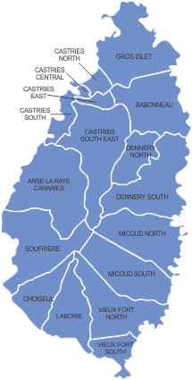

\newpage

# Abstract

This study examines how Short-Term Rental (STR) platform expansion in Saint Lucia has affected housing affordability, tenure composition, and household crowding across all 17 electoral constituencies. Using a Bartik shift-share instrumental variable design applied to full-population census microdata from 2010 and 2022, the study instruments for STR activity with each constituency's pre-existing concentration of natural geographic amenities — the Topographic Pull Index (TPI) — interacted with national stay-over arrivals growth (Δg = 0.187, pre-platform average 2010–2014 to post-launch average 2015–2019/2022). The endogenous variable is constructed directly from the 2022 IDDetail building enumeration using `DwellingStatus` codes 8 (Short Term Occupation) and 12 (AirBNB), yielding 245 census-verified STR-flagged structures — a purpose-built census category confirming enumerator-level recognition of platform-driven STR activity. Four findings emerge across the study's research channels. First (Rent Inflation), renters in high-TPI constituencies face a monthly rent premium of approximately 29% relative to the lowest-TPI constituencies, conditional on dwelling quality; this gradient is economically large but statistically underpowered at the 17-constituency level (cluster SE = 1.55, p = 0.45). Second (Stock Depletion), constituencies with more tourism attractions before STR platforms arrived saw their renter populations grow significantly faster between 2010 and 2022 — the causal estimate is β = 2.020 (cluster SE = 0.345, AR F = 34.29, p < 0.001) — consistent with tourism-corridor economic intensification, encompassing hospitality employment, government agencies, and commercial services concentrated in Gros Islet and Castries, generating in-migration of workers who require rental housing; the specific contribution of STR platform activity cannot be isolated without constituency-level labour force data. Third (Homeownership), owner-occupancy rates rose alongside renter rates in the highest-TPI constituencies, consistent with a sorting mechanism in which rising property values attract wealthier owner-occupiers. Fourth (Crowding), persons-per-bedroom declined in high-TPI areas, suggesting that lower-income, higher-crowding households were displaced outward and replaced by less-crowded owner-occupying and in-migrant worker households. A pre-period placebo regression (2001–2010), pending 2001 census data from the CSO, will directly test whether TPI predicted differential renter rate trends before STR platforms entered the market, providing a formal assessment of the exclusion restriction. Together, the findings indicate that STR platform expansion has intensified housing cost pressures and restructured tenure composition in Saint Lucia's tourism corridors, with affordability burdens concentrated among the renters who remain in the highest-TPI areas.

**Keywords:** short-term rentals, housing affordability, rent inflation, tenure composition, Bartik shift-share IV, Saint Lucia, small island developing states, homeownership, crowding

\newpage

# Research Questions

| # | Channel | Focus | Research Question |
|:-:|---|---|---|
| 1 | Price | Rent Inflation | Through what magnitude does the pecuniary externality of STRs accelerate rent inflation within high-density districts? |
| 2 | Supply | Stock Depletion | Does STR concentration facilitate a structural externality by reallocating housing stock away from long-term residential use? |
| 3 | Tenure | Homeownership | To what extent does the spatial concentration of STRs trigger a tenure-shift externality, reducing the rate of owner-occupancy? |
| 4 | Social | Crowding | Is the externality of STR growth associated with secondary market distortions, such as increased household crowding? |

\newpage

# Data Sources

## Overview

```{r setup}
library(haven)
library(tidyverse)
library(labelled)
library(knitr)
library(scales)
library(ggrepel)
library(kableExtra)
library(fixest)
library(modelsummary)

theme_set(
  theme_minimal(base_size = 10) +
    theme(
      plot.title    = element_text(face = "bold", size = 11),
      plot.subtitle = element_text(size = 9, color = "grey40"),
      plot.caption  = element_text(size = 7, color = "grey50"),
      axis.text     = element_text(size = 8),
      legend.position = "bottom",
      legend.text   = element_text(size = 8)
    )
)
```

```{r table-all-datasources}
tibble(
  `Data Source` = c(
    "2010 Population & Housing Census",
    "2022 Population & Housing Census",
    "2022 Building Enumeration File (IDDetail)",
    "Topographic Pull Index (TPI)",
    "CSO Tourism Statistics",
    "Airbtics STR Market Data (2025–2026)"
  ),
  File = c(
    "person_house_merged.sav",
    "PersonHHoldMerge 2022 Annon.sav",
    "IDDetail_merged_Anon_Weights_DwellStatus.sav",
    "TPI_constituency.csv",
    "Selected-Tourism-Statistics.csv",
    "Web (airbtics.com)"
  ),
  `Unit of Observation` = c(
    "Household",
    "Household",
    "Building",
    "Constituency",
    "National annual",
    "Constituency / sub-area"
  ),
  `Key Variables` = c(
    "Tenure (H13_OWN), bedrooms, household size, constituency (poldist), weight",
    "Tenure (h2_3a), rent (h2_3b1), bedrooms, constituency (CONSTITUENCY), weight",
    "DwellingStatus codes 8 + 12 (STR flag), districtCode",
    "TPI natural amenity share per constituency (Bartik IV share)",
    "Annual stay-over arrivals 2010–2022",
    "Active STR listing counts by area, 2025–2026"
  ),
  Status = c(
    "Available",
    "Available",
    "Available",
    "Available",
    "Available",
    "Available (current only)"
  )
) |>
  kable(caption = "Table 1. Complete inventory of data sources.")
```

## Census Microdata (2010 and 2022)

The primary data source is the Saint Lucia Population and Housing Census, with complete waves in 2010 (pre-STR) and 2022 (post-STR). Microdata were obtained from the Central Statistical Office and aggregated to the constituency level.

```{r table-census-comparison}
tibble(
  Feature = c(
    "Source", "Coverage", "Unit of observation",
    "Sample (households)", "Tenure variable",
    "Rent variable", "Bedrooms", "Household weight",
    "Constituency variable", "STR units (endogenous variable)"
  ),
  `2010 Census` = c(
    "CSO Saint Lucia person–household merged file",
    "Full population census",
    "Person (merged with household record)",
    "50,241",
    "H13_OWN (9 categories)",
    "Not collected",
    "H24_BEDROOMS",
    "HWEIGHT",
    "poldist (17 constituencies, codes 100–1700)",
    "Not available (pre-platform)"
  ),
  `2022 Census` = c(
    "CSO Saint Lucia PersonHHoldMerge (Anon.)",
    "Full population census",
    "Person (merged with household record)",
    "50,588",
    "h2_3a (12 categories)",
    "h2_3b1 (EC$/month)",
    "h2_15",
    "HHLD_WEIGHT",
    "CONSTITUENCY (17 constituencies, codes 100–1700)",
    "IDDetail: DwellingStatus codes 8 + 12 (n = 245 buildings)"
  )
) |>
  kable(caption = "Table 2. Census data source comparison.")
```

### Tenure Harmonisation

Tenure status is harmonised across census years to ensure comparability:

| Category | 2010 (H13_OWN) | 2022 (h2_3a) |
|---|---|---|
| Owner-occupied | 1 (Owned fully), 2 (Mortgage) | 1–3 (Owned fully), 4–6 (Mortgage) |
| Renter | 3 (Private), 4 (Govt) | 7 (Private), 8 (Govt) |
| Rent-free | 5 | 9 |

### Building-Level STR Units (IDDetail)

The 2022 IDDetail building enumeration file (`IDDetail_merged_Anon_Weights_DwellStatus.sav`) records the occupancy status of all 77,742 structures island-wide via the `DwellingStatus` variable. Two codes identify short-term rental use: **code 8** (Short Term Occupation, n = 162) and **code 12** (AirBNB, n = 83), yielding **245 STR-flagged buildings** in total. Notably, the census instrument uses "AirBNB" as a distinct occupancy category, reflecting explicit enumerator awareness of platform-driven short-term rental activity. These codes were assigned directly by census enumerators and unambiguously capture active STR use. Code 4 (Vacant – Seasonally) was considered but excluded: its district distribution is dominated by Vieux Fort and rural southern parishes — low-TPI areas where seasonal vacancy reflects migration and second-home patterns rather than platform-driven STR activity — and its inclusion would add noise rather than signal to the first stage. The 245 buildings are aggregated to the constituency level using household-weighted district-to-constituency disaggregation — the same methodology applied to the TPI instrument — and serve as the endogenous variable in the first stage and 2SLS.

#### DwellingStatus Code Reference

The full set of `DwellingStatus` codes assigned by census enumerators is shown below. Codes 8 and 12 form the narrow STR measure; code 4 is added only in the broad robustness specification.

| Code | Label | Role in Analysis |
|---:|---|---|
| 1 | Occupied | Baseline occupied stock |
| 2 | Closed — Residents away < 12 months | Non-STR |
| 3 | Closed — Residents away > 12 months | Non-STR |
| 4 | Vacant — Seasonally | **Broad STR measure only** (excluded from narrow) |
| 5 | Vacant — Non-Seasonally | Non-STR vacancy |
| 6 | Refused | Non-STR |
| 7 | No Contact / Temporarily Absent | Non-STR |
| 8 | **Short Term Occupation** | **Narrow STR measure** (n = 162) |
| 9 | Other | Excluded |
| 10 | Under Construction | Excluded |
| 11 | Demolished | Excluded |
| 12 | **AirBNB** | **Narrow STR measure** (n = 83) |

The frequency distribution of all codes (Table 7) is reported in the Data Loading section below, after the IDDetail file is read into memory.

## Topographic Pull Index (TPI)

The Topographic Pull Index (TPI) serves as the Bartik "share" component of the instrument. It measures each constituency's pre-existing concentration of natural geographic amenities relative to the rest of Saint Lucia, constructed entirely from fixed physical features predating the STR platform era so that it cannot be influenced by the outcome variables it is used to explain. Critically, no built tourism infrastructure — hotels, resorts, or guesthouses — is included; the index captures only landscape endowments that are immutable over the study period.

**Data source.** Natural amenity data were obtained from OpenStreetMap (OSM) via the Overpass API (queried May 2026), yielding georeferenced points of interest across Saint Lucia classified into natural feature categories: beaches, mountain peaks (including the Pitons), volcanic features and hot springs (including Sulphur Springs), waterfalls, nature reserves and national parks, scenic viewpoints, and marine dive sites.

**Weighting.** Each feature category was assigned an anchor weight reflecting its relative importance in attracting leisure visitors who generate STR demand: beaches (3), natural peaks (2.5), volcanic features and hot springs (2), waterfalls and nature reserves (2), scenic viewpoints (1.5), and dive sites and bays (1). For each district, the TPI raw score is the sum of all weighted feature counts within its boundaries.

**District-to-constituency disaggregation.** Saint Lucia's 17 electoral constituencies do not align with its 10 administrative districts. To produce constituency-level shares, each constituency was allocated a portion of its parent district's weighted attraction score in proportion to its share of the district's total household count from the 2010 census — before STR platforms existed. Babonneau, which spans the Castries and Gros Islet districts, receives summed contributions from both. The resulting 17 TPI values are normalised to sum to one island-wide.

**Validity.** Because both the natural feature locations and the 2010 household weights are fixed prior to the STR expansion period, the TPI shares are predetermined and cannot be affected by post-2014 housing market changes, satisfying the exogeneity condition of the Bartik design. The exclusion of built tourism infrastructure further strengthens the exclusion restriction: the instrument captures geographic pull that existed before any STR platform activity, not industry investment decisions that may correlate with housing market conditions.

```{r load-tpi}
# Topographic Pull Index (TPI): natural amenity features only.
# Overpass query used (overpass-turbo.eu):
#   [out:json][timeout:90];
#   area["ISO3166-1"="LC"][admin_level=2]->.lc;
#   (
#     node["natural"="beach"](area.lc); way["natural"="beach"](area.lc);
#     node["natural"="peak"](area.lc);
#     node["natural"="hot_spring"](area.lc);
#     node["natural"="bay"](area.lc);   way["natural"="bay"](area.lc);
#     node["waterway"="waterfall"](area.lc); way["waterway"="waterfall"](area.lc);
#     node["tourism"="viewpoint"](area.lc);
#     node["leisure"="nature_reserve"](area.lc);
#     way["leisure"="nature_reserve"](area.lc);
#     relation["leisure"="nature_reserve"](area.lc);
#     relation["boundary"="national_park"](area.lc);
#     node["sport"="scuba_diving"](area.lc);
#   );
#   out center;
# Weights: beach=3, peak=2.5, hot_spring/waterfall/reserve=2, viewpoint/dive=1.5, bay=1.
# Disaggregated district→constituency using 2010 census household weights.
tpi_data <- read.csv("TPI_topographic_constituency.csv") |>
  select(constituency, tpi, tourism_tier)
```

```{r table-tpi}
tpi_data |>
  arrange(desc(tpi)) |>
  mutate(tpi_pct = paste0(round(tpi * 100, 1), "%")) |>
  select(Constituency = constituency, `TPI Share` = tpi_pct, Tier = tourism_tier) |>
  kable(caption = "Table 3. Topographic Pull Index (TPI) by constituency. Natural amenity features only (beaches, peaks, waterfalls, nature reserves, viewpoints, dive sites); no built tourism infrastructure. Source: OpenStreetMap / Overpass API (May 2026); household-weighted disaggregation from 2010 census.")
```

::: {#fig-tpi-map layout-ncol=2}




Figure 2. Left: District-level Topographic Pull Index (TPI) share disaggregated to constituencies via 2010 census household weights. Gros Islet and Soufrière are the dominant natural amenity districts. Right: Saint Lucia constituency boundary reference map.
:::

## National Tourism Shift

The national shift is the growth in island-wide stay-over arrivals from the pre-STR average (2010–2014) to the post-launch average (2015–2019, 2022). Pandemic years 2020–2021 are excluded because COVID-19 collapsed arrivals by ~70%, which would otherwise suppress the post-period mean and understate the STR-era expansion.

| Period | Years | Mean Arrivals |
|---|---|---|
| Pre-STR | 2010–2014 | 316,385 |
| Post-launch | 2015–2019, 2022 | 375,610 |
| **Arrivals shift** | | **+18.7% (Δg = 0.187)** |

\newpage

## Contextual STR Listing Evidence

Airbtics (airbtics.com) reports **1,529 active STR listings** island-wide as of June 2026, providing an independent benchmark against which the IDDetail-derived STR counts can be evaluated. The geographic breakdown confirms heavy concentration in the highest-TPI areas, consistent with the Bartik identification assumption.

```{r table-str-context}
tibble(
  Source = c(
    "Airbtics — Castries (2025–2026)",
    "Airbtics — Soufrière (2025–2026)",
    "Airbtics — Gros Islet sub-areas (2025–2026)",
    "Airbtics — Vieux Fort (2025–2026)",
    "Airbtics — Island-wide (June 2026)"
  ),
  `Listing Count` = c(
    "223 (Castries cluster)",
    "120 (Soufrière town) + 19 (Fond Saint Jacques)",
    "46 (Corinth) + 21 (Grande Rivière) + 18 (Cap Estate)",
    "43",
    "1,529 (total active listings)"
  ),
  Notes = c(
    "Highest-TPI constituency cluster",
    "Second-highest TPI constituency",
    "Partial sub-area counts only",
    "Smaller southern market",
    "Independent benchmark; 4 years post-census"
  )
) |>
  kable(caption = "Table 4. Airbtics STR listing counts by area, 2025–2026. Geographic concentration in Gros Islet and Soufrière mirrors the TPI distribution. Source: Airbtics (airbtics.com), accessed June 2026. Note: partial sub-area counts; island-wide total from platform-level aggregate.")
```

\newpage

# Methodology

## Data Loading and Processing

```{r load-data}
raw_2022 <- read_sav("PersonHHoldMerge 2022 Annon.sav")

cons_name_map <- c(
  "100"  = "Gros Islet",        "200"  = "Babonneau",
  "300"  = "Castries North",    "400"  = "Castries East",
  "500"  = "Castries Central",  "600"  = "Castries South",
  "700"  = "Anse-la-Raye/Canaries",
  "800"  = "Soufriere",         "900"  = "Choiseul",
  "1000" = "Laborie",           "1100" = "Vieux-Fort South",
  "1200" = "Vieux-Fort North",  "1300" = "Micoud South",
  "1400" = "Micoud North",      "1500" = "Dennery South",
  "1600" = "Dennery North",     "1700" = "Castries South-East"
)

hh_2022 <- raw_2022 |>
  distinct(CompositeKey, .keep_all = TRUE) |>
  select(CompositeKey, CONSTITUENCY, Npersons,
         h2_3a, h2_3b1, h2_15, HHLD_WEIGHT) |>
  rename(
    household_id    = CompositeKey,
    constituency_id = CONSTITUENCY,
    household_size  = Npersons,
    tenure          = h2_3a,
    monthly_rent    = h2_3b1,
    bedrooms        = h2_15,
    hh_weight       = HHLD_WEIGHT
  ) |>
  zap_labels() |>
  mutate(
    across(c(tenure, monthly_rent, bedrooms, household_size, constituency_id),
           ~ if_else(. %in% c(-999999999, 999999999), NA_real_, as.numeric(.))),
    constituency = cons_name_map[as.character(as.integer(constituency_id))],
    owner    = if_else(tenure %in% 1:6, 1, 0),
    renter   = if_else(tenure %in% 7:8, 1, 0),
    rentfree = if_else(tenure == 9,     1, 0),
    persons_per_bedroom = if_else(bedrooms > 0, household_size / bedrooms, NA_real_)
  ) |>
  filter(!is.na(constituency))

raw_2010 <- read_sav("person_house_merged.sav")

hh_2010 <- raw_2010 |>
  mutate(household_id_2010 = paste(DISTRICT, ED, HH, sep = "_")) |>
  group_by(household_id_2010) |>
  mutate(HWEIGHT = suppressWarnings(max(HWEIGHT, na.rm = TRUE)),
         HWEIGHT = if_else(is.infinite(HWEIGHT), NA_real_, HWEIGHT)) |>
  ungroup() |>
  distinct(household_id_2010, .keep_all = TRUE) |>
  select(household_id_2010, poldist, NPERS, H13_OWN, H24_BEDROOMS, HWEIGHT) |>
  rename(
    household_id    = household_id_2010,
    constituency_id = poldist,
    household_size  = NPERS,
    tenure          = H13_OWN,
    bedrooms        = H24_BEDROOMS,
    hh_weight       = HWEIGHT
  ) |>
  zap_labels() |>
  mutate(
    across(c(tenure, bedrooms, household_size, constituency_id),
           ~ if_else(. %in% c(-999999999, 999999999), NA_real_, as.numeric(.))),
    persons_per_bedroom = if_else(bedrooms > 0, household_size / bedrooms, NA_real_),
    constituency = cons_name_map[as.character(as.integer(constituency_id))],
    owner    = if_else(tenure %in% c(1, 2), 1, 0),
    renter   = if_else(tenure %in% c(3, 4), 1, 0),
    rentfree = if_else(tenure == 5, 1, 0)
  ) |>
  filter(!is.na(constituency))
```

```{r load-iddetail}
raw_iddetail <- read_sav("IDDetail_merged_Anon_Weights_DwellStatus.sav") |>
  zap_labels() |>
  mutate(
    district_code  = districtCode,
    str_unit       = if_else(DwellingStatus %in% c(8, 12),    1L, 0L),
    str_unit_broad = if_else(DwellingStatus %in% c(4, 8, 12), 1L, 0L)
  ) |>
  filter(!is.na(district_code)) |>
  mutate(
    district = case_match(as.integer(district_code),
      2  ~ "Castries",   3  ~ "AnselaRaye", 4  ~ "Canaries",
      5  ~ "Soufriere",  6  ~ "Choiseul",   7  ~ "Laborie",
      8  ~ "VieuxFort",  9  ~ "Micoud",     10 ~ "Dennery",
      11 ~ "GrosIslet"
    )
  )
```

```{r table-dwellstatus-dist}
raw_iddetail |>
  count(DwellingStatus) |>
  arrange(DwellingStatus) |>
  mutate(
    pct      = round(n / sum(n) * 100, 2),
    label    = case_match(
      DwellingStatus,
      1  ~ "Occupied",
      2  ~ "Closed — Residents away < 12 months",
      3  ~ "Closed — Residents away > 12 months",
      4  ~ "Vacant — Seasonally",
      5  ~ "Vacant — Non-Seasonally",
      6  ~ "Refused",
      7  ~ "No Contact / Temporarily Absent",
      8  ~ "Short Term Occupation",
      9  ~ "Other",
      10 ~ "Under Construction",
      11 ~ "Demolished",
      12 ~ "AirBNB",
      .default = "Unknown"
    ),
    str_role = case_match(
      DwellingStatus,
      8  ~ "Narrow STR",
      12 ~ "Narrow STR",
      4  ~ "Broad only",
      .default = "—"
    )
  ) |>
  select(
    Code       = DwellingStatus,
    Label      = label,
    `STR Role` = str_role,
    N          = n,
    `%`        = pct
  ) |>
  kable(
    caption = "Table 7. Distribution of DwellingStatus codes in the 2022 IDDetail building enumeration file (N = 77,742 structures). Codes 8 and 12 form the narrow STR measure (n = 245); code 4 is added in the broad robustness specification only. Source: CSO Saint Lucia 2022 Building Enumeration File.",
    align   = c("r", "l", "l", "r", "r")
  )
```

```{r iddetail-str}
dist_to_cons <- tribble(
  ~district,     ~constituency,
  "Castries",    "Babonneau",
  "Castries",    "Castries North",
  "Castries",    "Castries East",
  "Castries",    "Castries Central",
  "Castries",    "Castries South",
  "Castries",    "Castries South-East",
  "AnselaRaye",  "Anse-la-Raye/Canaries",
  "Canaries",    "Anse-la-Raye/Canaries",
  "Soufriere",   "Soufriere",
  "Choiseul",    "Choiseul",
  "Laborie",     "Laborie",
  "VieuxFort",   "Vieux-Fort South",
  "VieuxFort",   "Vieux-Fort North",
  "Micoud",      "Micoud South",
  "Micoud",      "Micoud North",
  "Dennery",     "Dennery South",
  "Dennery",     "Dennery North",
  "GrosIslet",   "Gros Islet"
)

cons_hh_wts <- hh_2010 |>
  filter(!is.na(hh_weight)) |>
  group_by(constituency) |>
  summarise(hh_wt = sum(hh_weight), .groups = "drop")

make_cons_str <- function(unit_var, count_name) {
  dist_to_cons |>
    left_join(cons_hh_wts, by = "constituency") |>
    left_join(
      raw_iddetail |> group_by(district) |>
        summarise(dist_str = sum(.data[[unit_var]], na.rm = TRUE), .groups = "drop"),
      by = "district"
    ) |>
    group_by(district) |>
    mutate(cons_share = hh_wt / sum(hh_wt, na.rm = TRUE)) |>
    ungroup() |>
    group_by(constituency) |>
    summarise(!!count_name := sum(dist_str * cons_share, na.rm = TRUE), .groups = "drop")
}

cons_str       <- make_cons_str("str_unit",       "str_count")
cons_str_broad <- make_cons_str("str_unit_broad",  "str_count_broad")
```

```{r constituency-summaries}
cons_2022 <- hh_2022 |>
  filter(!is.na(hh_weight)) |>
  group_by(constituency) |>
  summarise(
    renter_rate_22   = weighted.mean(renter,              hh_weight, na.rm = TRUE),
    owner_rate_22    = weighted.mean(owner,               hh_weight, na.rm = TRUE),
    rentfree_rate_22 = weighted.mean(rentfree,            hh_weight, na.rm = TRUE),
    hh_size_22       = weighted.mean(household_size,      hh_weight, na.rm = TRUE),
    ppbr_22          = weighted.mean(persons_per_bedroom, hh_weight, na.rm = TRUE),
    .groups = "drop"
  )

cons_2010 <- hh_2010 |>
  filter(!is.na(hh_weight)) |>
  group_by(constituency) |>
  summarise(
    renter_rate_10   = weighted.mean(renter,              hh_weight, na.rm = TRUE),
    owner_rate_10    = weighted.mean(owner,               hh_weight, na.rm = TRUE),
    rentfree_rate_10 = weighted.mean(rentfree,            hh_weight, na.rm = TRUE),
    hh_size_10       = weighted.mean(household_size,      hh_weight, na.rm = TRUE),
    ppbr_10          = weighted.mean(persons_per_bedroom, hh_weight, na.rm = TRUE),
    .groups = "drop"
  )
```

```{r shifts}
tourism_raw <- read.csv("Selected-Tourism-Statistics.csv",
                        header = FALSE, stringsAsFactors = FALSE)
stay_annual <- tourism_raw |>
  setNames(paste0("V", seq_len(ncol(tourism_raw)))) |>
  filter(grepl("Stay-Over Arrivals", V2, fixed = TRUE)) |>
  mutate(
    year   = as.integer(substr(trimws(V5), 1, 4)),
    amount = as.numeric(gsub(",", "", trimws(V6)))
  ) |>
  filter(!is.na(year), !is.na(amount)) |>
  group_by(year) |>
  summarise(arrivals = sum(amount), .groups = "drop")

pre_avg        <- mean(stay_annual$arrivals[stay_annual$year %in% 2010:2014])
post_avg       <- mean(stay_annual$arrivals[stay_annual$year %in% c(2015:2019, 2022)])
national_shift <- (post_avg - pre_avg) / pre_avg

```

```{r master-panel}
cons_wide <- cons_2010 |>
  left_join(cons_2022,       by = "constituency") |>
  left_join(tpi_data,        by = "constituency") |>
  left_join(cons_str,        by = "constituency") |>
  left_join(cons_str_broad,  by = "constituency") |>
  mutate(
    d_renter  = (renter_rate_22 - renter_rate_10) * 100,
    d_owner   = (owner_rate_22  - owner_rate_10)  * 100,
    d_hh_size = hh_size_22 - hh_size_10,
    d_ppbr    = ppbr_22    - ppbr_10
  )

panel <- bind_rows(
  cons_2010 |>
    left_join(tpi_data, by = "constituency") |>
    mutate(year = 2010, post = 0,
           renter_rate   = renter_rate_10,
           owner_rate    = owner_rate_10,
           rentfree_rate = rentfree_rate_10,
           hh_size       = hh_size_10,
           ppbr          = ppbr_10,
           str_count       = 0,
           str_count_broad = 0),
  cons_2022 |>
    left_join(tpi_data,       by = "constituency") |>
    left_join(cons_str,       by = "constituency") |>
    left_join(cons_str_broad, by = "constituency") |>
    mutate(year = 2022, post = 1,
           renter_rate   = renter_rate_22,
           owner_rate    = owner_rate_22,
           rentfree_rate = rentfree_rate_22,
           hh_size       = hh_size_22,
           ppbr          = ppbr_22)
) |>
  mutate(tpi_post = tpi * national_shift * post)

hh_panel <- bind_rows(
  hh_2010 |> mutate(year = 2010L, post = 0L),
  hh_2022 |> mutate(year = 2022L, post = 1L)
) |>
  left_join(tpi_data |> select(constituency, tpi), by = "constituency") |>
  left_join(panel    |> select(constituency, year, str_count, str_count_broad),
            by = c("constituency", "year")) |>
  mutate(tpi_post = tpi * national_shift * post)
```

## Identification Strategy: Bartik Shift-Share IV

The study uses a **Bartik (shift-share) instrumental variable** design. STR platform expansion after 2014 was a common national shock, but its local impact was proportional to each constituency's pre-existing endowment of natural geographic amenities. This cross-constituency heterogeneity in pre-determined topographic pull is the source of identifying variation. Figure 1 presents the causal structure as a Directed Acyclic Graph.

```{r fig-dag, fig.cap="DAG of the Bartik shift-share IV. The instrument Z satisfies the exclusion restriction by affecting housing outcomes only through STR penetration. Grey = exogenous inputs; blue = endogenous treatment; red = outcome; orange = unobserved confounder.", fig.height=4, fig.width=7}
dag_nodes <- tibble(
  id    = c("TPI", "DeltaG", "Z", "D", "Y", "U"),
  label = c(
    "Tourism Proximity\nIndex (TPI)",
    "National Tourism\nGrowth (Δg)",
    "Bartik IV\n(TPI × Δg × Post)",
    "STR\nPenetration",
    "Housing Outcomes\n(Renter Rate, Rent)",
    "Unobserved\nConfounders"
  ),
  x    = c(0, 0, 3, 6, 9, 7.5),
  y    = c(1.2, -1.2, 0, 0, 0, 2.0),
  role = c("Instrument", "Instrument", "Instrument",
           "Treatment", "Outcome", "Confounder")
)

dag_edges <- tibble(
  from  = c("TPI",   "DeltaG", "Z",     "D",     "U",      "U"),
  to    = c("Z",     "Z",      "D",     "Y",     "D",      "Y"),
  ltype = c("solid", "solid",  "solid", "solid", "dashed", "dashed")
) |>
  left_join(dag_nodes |> select(id, x, y), by = c("from" = "id")) |>
  rename(x0 = x, y0 = y) |>
  left_join(dag_nodes |> select(id, x, y), by = c("to" = "id")) |>
  rename(x1 = x, y1 = y)

ggplot() +
  geom_segment(
    data = dag_edges,
    aes(x = x0, y = y0, xend = x1, yend = y1, linetype = ltype),
    arrow = arrow(length = unit(0.2, "cm"), type = "closed"),
    color = "grey30", linewidth = 0.6
  ) +
  geom_label(
    data = dag_nodes,
    aes(x = x, y = y, label = label, fill = role),
    color = "white", size = 2.5, fontface = "bold",
    lineheight = 0.9, label.size = 0.4,
    label.r = unit(0.25, "lines"), label.padding = unit(0.3, "lines")
  ) +
  scale_fill_manual(
    values = c(Instrument = "grey55", Treatment = "#2C7BB6",
               Outcome = "#D7191C", Confounder = "#FDAE61"),
    name = NULL
  ) +
  scale_linetype_manual(
    values = c(solid = "solid", dashed = "dashed"),
    labels = c(solid = "Observed causal path", dashed = "Unobserved confounding"),
    name = NULL
  ) +
  xlim(-1.5, 10.5) + ylim(-2.5, 3.0) +
  labs(
    title    = "DAG: Bartik Shift-Share IV Identification Strategy",
    subtitle = "No direct path from IV to Outcome — exclusion restriction satisfied by construction"
  ) +
  theme_void(base_size = 10) +
  theme(
    plot.title    = element_text(face = "bold", size = 11),
    plot.subtitle = element_text(size = 9, color = "grey40"),
    legend.position = "bottom", legend.text = element_text(size = 8)
  ) +
  guides(
    fill     = guide_legend(order = 1, override.aes = list(color = NA)),
    linetype = guide_legend(order = 2)
  )
```

The Bartik instrument interacts each constituency's pre-determined tourism share with the national STR-era growth shock:

$$Z_{ct} = \underbrace{TPI_c}_{\text{Share}} \times \underbrace{\Delta g^{\text{national}}}_{\text{Shift}} \times \text{Post}_t$$

The exclusion restriction requires TPI to affect housing outcomes *only through* STR activity. Three main threats are acknowledged. First, **concurrent amenity-driven investment** in high-TPI constituencies — such as new resort or hotel construction attracted by the same natural features — could independently raise rents and attract workers; however, because TPI is constructed from immutable geographic features rather than built infrastructure, it does not mechanically capture this investment. Second, **pre-existing spatial trends** — testable via a pre-period placebo over 2001–2010 (pending 2001 census data). Third, **urban employment confounding**: Gros Islet and Castries are Saint Lucia's primary urban employment corridors, hosting hospitality operations, government agencies, public sector offices, and commercial services. Workers relocating for employment in *any* of these sectors would register as new renters in the census, regardless of whether their jobs are directly linked to STR platform activity. The estimated effect therefore reflects tourism-corridor economic intensification broadly, and the specific STR platform mechanism cannot be isolated without constituency-level labour force data. The shift is the growth in national stay-over arrivals (Δg = 0.187, pre-STR average 2010–2014 to post-launch average 2015–2019, 2022).

The three-equation system is:

**Reduced form:**
$$Y_{ict} = \alpha + \beta^{RF}(TPI_c \times \Delta g \times \text{Post}_t) + \gamma_c + \delta_t + \varepsilon_{ict}$$

where $Y_{ict}$ is a binary indicator equal to 1 if household $i$ in constituency $c$ at time $t$ rents its dwelling (0 otherwise). This is a Linear Probability Model (LPM). The fixed effects $\gamma_c$ absorb the baseline renter rate in each constituency and $\delta_t$ absorbs any common year shift, so $\beta^{RF}$ captures the differential *change* in renting probability between high- and low-TPI constituencies — the same quantity shown graphically as the slope of the constituency-level scatter in Figure 5, but estimated on household-level data with census weights.

**First stage:**
$$\text{STR}_{ct} = \alpha + \pi(TPI_c \times \Delta g \times \text{Post}_t) + \gamma_c + \delta_t + u_{ct}$$

**2SLS:** $\beta^{IV} = \beta^{RF} / \hat{\pi}$

\newpage

# Descriptive Results

## Constituency-Level Housing Outcomes

```{r table-constituency-outcomes}
cons_wide |>
  arrange(desc(tpi)) |>
  mutate(
    across(c(renter_rate_10, renter_rate_22, owner_rate_10, owner_rate_22),
           ~ round(. * 100, 1)),
    tpi      = round(tpi, 3),
    d_renter = round(d_renter, 1),
    d_owner  = round(d_owner,  1),
    across(c(hh_size_10, hh_size_22, d_hh_size), ~ round(., 2))
  ) |>
  select(constituency, tpi,
         renter_rate_10, renter_rate_22, d_renter,
         owner_rate_10,  owner_rate_22,  d_owner,
         hh_size_10,     hh_size_22) |>
  kable(
    col.names = c(
      "Constituency", "TPI",
      "Rent. '10", "Rent. '22", "ΔRent",
      "Own. '10",  "Own. '22",  "ΔOwn",
      "HH Sz '10", "HH Sz '22"
    ),
    caption = "Table 5. Constituency-level housing outcomes, Saint Lucia 2010–2022. Rent. = renter rate (%); Own. = owner rate (%); HH Sz = mean household size; Δ = change in percentage points. Ordered by TPI (high to low). Source: CSO Saint Lucia Population and Housing Census 2010, 2022."
  )
```

## STR Units by Constituency

```{r table-str-constituency}
cons_str |>
  left_join(tpi_data, by = "constituency") |>
  arrange(desc(tpi)) |>
  mutate(
    str_rounded = round(str_count, 1),
    `TPI Share` = paste0(round(tpi * 100, 1), "%")
  ) |>
  select(Constituency = constituency, `Tourism Tier` = tourism_tier,
         `TPI Share`, `Est. STR Units` = str_rounded) |>
  kable(caption = "Table 6. Estimated STR units by constituency, 2022. STR units = buildings with DwellingStatus 8 (Short Term Occupation) or 12 (AirBNB) in the 2022 IDDetail building enumeration (245 total). Disaggregated from district to constituency using 2010 census household weights. Ordered by TPI (high to low). Source: CSO Saint Lucia 2022 Building Enumeration File (IDDetail_merged_Anon_Weights_DwellStatus.sav).")
```

## Renter Rates by Constituency, 2010 vs. 2022

```{r fig-renter-rates, fig.cap="Renter Rate by Constituency, 2010 vs. 2022. Ordered by TPI (bottom = highest TPI). Source: CSO Saint Lucia Population and Housing Census 2010, 2022.", fig.height=6}
cons_wide |>
  arrange(tpi) |>
  mutate(constituency = factor(constituency, levels = constituency)) |>
  select(constituency, tpi, renter_rate_10, renter_rate_22) |>
  pivot_longer(c(renter_rate_10, renter_rate_22),
               names_to = "year", values_to = "renter_rate") |>
  mutate(
    year  = if_else(year == "renter_rate_10", "2010", "2022"),
    label = scales::percent(renter_rate, accuracy = 0.1)
  ) |>
  ggplot(aes(x = renter_rate, y = constituency, fill = year)) +
  geom_col(position = position_dodge(width = 0.7), width = 0.6) +
  geom_text(aes(label = label),
            position = position_dodge(width = 0.7),
            hjust = -0.1, size = 2.2) +
  scale_x_continuous(labels = scales::percent,
                     expand = expansion(mult = c(0, 0.18))) +
  scale_fill_manual(values = c("2010" = "#D7191C", "2022" = "#FDAE61"),
                    name = "Census Year") +
  labs(
    title    = "Renter Rate by Constituency, 2010 vs. 2022",
    subtitle = "Constituencies ordered by TPI (bottom = highest tourism share)",
    x = "Share of Households Renting", y = NULL,
    caption  = "Source: CSO Saint Lucia Population and Housing Census 2010, 2022."
  )
```

## Monthly Rent by Constituency, 2022

```{r fig-rent-2022, fig.cap="Median Monthly Rent by Constituency, 2022. Renter-occupied households only; ordered by median rent. Source: CSO Saint Lucia Population and Housing Census 2022.", fig.height=6}
hh_2022 |>
  filter(tenure %in% 7:8,
         !is.na(monthly_rent),
         monthly_rent > 0, monthly_rent < 99999) |>
  left_join(cons_wide |> select(constituency, tourism_tier), by = "constituency") |>
  mutate(tourism_tier = factor(tourism_tier, levels = c("High", "Medium", "Low"))) |>
  group_by(constituency, tourism_tier) |>
  summarise(median_rent = median(rep(monthly_rent, times = round(hh_weight))),
            .groups = "drop") |>
  arrange(median_rent) |>
  mutate(constituency = factor(constituency, levels = constituency),
         label        = paste0("EC$", format(round(median_rent), big.mark = ","))) |>
  ggplot(aes(x = median_rent, y = constituency, fill = tourism_tier)) +
  geom_col(width = 0.7) +
  geom_text(aes(label = label), hjust = -0.1, size = 2.5) +
  scale_x_continuous(labels = dollar_format(prefix = "EC$"),
                     expand = expansion(mult = c(0, 0.22))) +
  scale_fill_manual(values = c("High" = "#D7191C", "Medium" = "#FDAE61", "Low" = "#2C7BB6"),
                    name = "Tourism Tier") +
  labs(
    title    = "Median Monthly Rent by Constituency, 2022",
    subtitle = "Renter-occupied households only; ordered by median rent",
    x = "Median Monthly Rent (EC$)", y = NULL,
    caption  = "Source: CSO Saint Lucia Population and Housing Census 2022."
  )
```

\newpage

# Regression Results

## Figure 5: Reduced-Form Relationship — TPI vs Change in Renter Rate

```{r fig-scatter-renter, fig.cap="Pre-STR Tourism Intensity vs. Change in Renter Rate, 2010–2022. Each point is one constituency. Source: CSO Saint Lucia Census 2010, 2022; OSM / 2010 census HH-weighted TPI."}
cons_wide |>
  mutate(tourism_tier = factor(tourism_tier, levels = c("High", "Medium", "Low"))) |>
  ggplot(aes(x = tpi, y = d_renter, label = constituency, color = tourism_tier)) +
  geom_smooth(method = "lm", se = TRUE,
              color = "grey50", fill = "grey85", linewidth = 0.7) +
  geom_point(size = 3, alpha = 0.9) +
  geom_text_repel(size = 2.5, max.overlaps = 17, show.legend = FALSE) +
  scale_color_manual(
    values = c("High" = "#D7191C", "Medium" = "#FDAE61", "Low" = "#2C7BB6"),
    name = "Tourism Tier"
  ) +
  labs(
    title    = "Pre-STR Tourism Intensity vs. Change in Renter Rate",
    subtitle = "Each point is one constituency; slope shows the reduced-form Bartik relationship",
    x        = "Tourism Proximity Index (TPI, pre-STR share)",
    y        = "Change in Renter Rate 2010–2022 (pct. points)",
    caption  = "Source: CSO Saint Lucia Census 2010, 2022; OSM / 2010 HH-weighted TPI."
  )
```

Figure 5 is the visual representation of the reduced-form relationship: each constituency's pre-existing tourism share (TPI) plotted against the aggregate change in its renter rate between 2010 and 2022. The scatter uses constituency-level averages (`d_renter = renter_rate_22 − renter_rate_10`) purely for illustration. The formal regression in Table 9 operates at the household level, using a binary renter indicator (1 = renting, 0 = otherwise) across both census years. The two-way fixed effects — absorbing a constituency-level intercept and a common year effect — difference out the 2010 baseline for each constituency, so the coefficient on `tpi_post` captures exactly the same quantity as the scatter slope: how much the change in renting probability from 2010 to 2022 differs across constituencies with different levels of pre-STR tourism intensity. The regression is the preferred specification because it exploits household-level variation and properly accounts for differences in constituency size through census weights.

## Figure 6: STR Count vs Change in Renter Rate — Narrow vs Broad Measure

Figure 6 replaces TPI on the x-axis with the actual STR unit count, allowing direct comparison of the two measurement strategies. Figure 6a uses the narrow measure (codes 8+12, n = 245); Figure 6b adds seasonal vacancy (codes 4+8+12, n = 1,393). A steeper, tighter slope in 6a relative to 6b supports the narrow measure as the cleaner proxy for STR-driven displacement.

```{r fig-scatter-narrow, fig.cap="Narrow STR Count (codes 8+12, n=245) vs. Change in Renter Rate, 2010–2022. Each point is one constituency. Source: CSO Saint Lucia Census 2010, 2022; IDDetail building enumeration 2022."}
cons_wide |>
  mutate(tourism_tier = factor(tourism_tier, levels = c("High", "Medium", "Low"))) |>
  ggplot(aes(x = str_count, y = d_renter, label = constituency, color = tourism_tier)) +
  geom_smooth(method = "lm", se = TRUE,
              color = "grey50", fill = "grey85", linewidth = 0.7) +
  geom_point(size = 3, alpha = 0.9) +
  geom_text_repel(size = 2.5, max.overlaps = 17, show.legend = FALSE) +
  scale_color_manual(
    values = c("High" = "#D7191C", "Medium" = "#FDAE61", "Low" = "#2C7BB6"),
    name = "Tourism Tier"
  ) +
  labs(
    title    = "Narrow STR Count vs. Change in Renter Rate",
    subtitle = "STR = DwellingStatus codes 8 + 12 only (n = 245 buildings)",
    x        = "Estimated STR Units per Constituency (codes 8+12)",
    y        = "Change in Renter Rate 2010–2022 (pct. points)",
    caption  = "Source: CSO Saint Lucia Census 2010, 2022; IDDetail building enumeration 2022."
  )
```

```{r fig-scatter-broad, fig.cap="Broad STR Count (codes 4+8+12, n=1,393) vs. Change in Renter Rate, 2010–2022. Each point is one constituency. Source: CSO Saint Lucia Census 2010, 2022; IDDetail building enumeration 2022."}
cons_wide |>
  mutate(tourism_tier = factor(tourism_tier, levels = c("High", "Medium", "Low"))) |>
  ggplot(aes(x = str_count_broad, y = d_renter, label = constituency, color = tourism_tier)) +
  geom_smooth(method = "lm", se = TRUE,
              color = "grey50", fill = "grey85", linewidth = 0.7) +
  geom_point(size = 3, alpha = 0.9) +
  geom_text_repel(size = 2.5, max.overlaps = 17, show.legend = FALSE) +
  scale_color_manual(
    values = c("High" = "#D7191C", "Medium" = "#FDAE61", "Low" = "#2C7BB6"),
    name = "Tourism Tier"
  ) +
  labs(
    title    = "Broad STR Count vs. Change in Renter Rate",
    subtitle = "STR = codes 4 + 8 + 12 (n = 1,393 buildings, includes seasonal vacancy)",
    x        = "Estimated STR Units per Constituency (codes 4+8+12)",
    y        = "Change in Renter Rate 2010–2022 (pct. points)",
    caption  = "Source: CSO Saint Lucia Census 2010, 2022; IDDetail building enumeration 2022."
  )
```

If code 4 introduces noise — as the geographic analysis suggests — Figure 6b will show a flatter, less consistent slope than 6a, with low-TPI constituencies (Vieux Fort, Laborie) pulling the line away from the high-TPI displacement pattern.

## Figure 7: District-Level TPI vs Change in Renter Rate

Figure 7 repeats the reduced-form scatter at the **district level** (10 districts) rather than constituency level (17 constituencies). It uses the district-level TPI — the same OSM attraction-weighted methodology as the constituency instrument, but before household-weighted disaggregation — to confirm that the negative reduced-form pattern holds at a coarser geographic unit.

```{r district-data}
# Constituency → district mapping
cons_to_dist <- tribble(
  ~constituency,           ~district,
  "Gros Islet",            "Gros Islet",
  "Babonneau",             "Castries",
  "Castries North",        "Castries",
  "Castries East",         "Castries",
  "Castries Central",      "Castries",
  "Castries South",        "Castries",
  "Castries South-East",   "Castries",
  "Anse-la-Raye/Canaries", "Anse-la-Raye",
  "Soufriere",             "Soufriere",
  "Choiseul",              "Choiseul",
  "Laborie",               "Laborie",
  "Vieux-Fort South",      "Vieux Fort",
  "Vieux-Fort North",      "Vieux Fort",
  "Micoud South",          "Micoud",
  "Micoud North",          "Micoud",
  "Dennery South",         "Dennery",
  "Dennery North",         "Dennery"
)

# Aggregate constituency outcomes to district (weighted by 2010 HH count)
dist_wide <- cons_wide |>
  left_join(cons_to_dist, by = "constituency") |>
  left_join(cons_hh_wts,  by = "constituency") |>
  group_by(district) |>
  summarise(
    renter_rate_10 = weighted.mean(renter_rate_10, hh_wt, na.rm = TRUE),
    renter_rate_22 = weighted.mean(renter_rate_22, hh_wt, na.rm = TRUE),
    d_renter       = (renter_rate_22 - renter_rate_10) * 100,
    .groups = "drop"
  )

# District-level TPI (OSM attraction-weighted, tpi_v2)
tpi_osm <- read.csv("TPI_v2_attraction_concentration.csv") |>
  select(district, tpi_osm = tpi_v2)

dist_plot <- dist_wide |>
  left_join(tpi_osm, by = "district")
```

```{r fig-dist-osm, fig.cap="District TPI vs. Change in Renter Rate, 2010–2022. Each point is one of 10 districts. District outcomes aggregated from constituency level using 2010 household weights. Source: CSO Saint Lucia Census 2010, 2022; OpenStreetMap / Overpass API (May 2026)."}
dist_plot |>
  ggplot(aes(x = tpi_osm, y = d_renter, label = district)) +
  geom_smooth(method = "lm", se = TRUE,
              color = "grey50", fill = "grey85", linewidth = 0.7) +
  geom_point(size = 3, color = "#2C7BB6", alpha = 0.9) +
  geom_text_repel(size = 2.8, max.overlaps = 10) +
  labs(
    title    = "District TPI vs. Change in Renter Rate",
    subtitle = "10 districts; same attraction-weighted methodology as constituency TPI",
    x        = "District TPI (attraction concentration share)",
    y        = "Change in Renter Rate 2010–2022 (pct. points)",
    caption  = "Source: CSO Saint Lucia Census 2010, 2022; OpenStreetMap / Overpass API (May 2026)."
  )
```

Figure 7 confirms that the negative relationship between tourism intensity and renter rate change visible at the constituency level (Figure 5) persists when the data are aggregated to 10 districts, supporting the robustness of the reduced-form pattern.

```{r lpm-setup}
lpm <- feols(renter ~ tpi_post | constituency + year,
             data = hh_panel, weights = ~hh_weight, vcov = ~constituency)
```

## Table 8: Log Monthly Rent — 2022 Cross-Section

The 2010 census did not collect rent, so the rent outcome is a 2022 cross-section on renter households. Constituency FEs are excluded because TPI is a constituency-level variable and would be perfectly collinear with constituency dummies; unit-level controls absorb dwelling quality instead.

$$\log(\text{Rent}_{ic}) = \alpha + \beta \cdot TPI_c + \theta_1 \cdot \text{Bedrooms}_{ic} + \theta_2 \cdot \text{HHSize}_{ic} + \varepsilon_{ic}$$

```{r rent-regressions}
hh_rent_22 <- hh_panel |>
  filter(year == 2022,
         tenure %in% 7:8,
         !is.na(monthly_rent),
         monthly_rent > 0, monthly_rent < 99999,
         !is.na(bedrooms), bedrooms > 0,
         !is.na(household_size)) |>
  mutate(
    log_rent = log(monthly_rent),
    ppbr     = if_else(bedrooms > 0, household_size / bedrooms, NA_real_)
  )

rent1 <- feols(log_rent ~ tpi,
               data = hh_rent_22, weights = ~hh_weight, vcov = ~constituency)
rent2 <- feols(log_rent ~ tpi + bedrooms + household_size,
               data = hh_rent_22, weights = ~hh_weight, vcov = ~constituency)
rent3 <- feols(log_rent ~ tpi + bedrooms + household_size + ppbr,
               data = hh_rent_22, weights = ~hh_weight, vcov = ~constituency)

modelsummary(
  list("(1) No controls" = rent1, "(2) Unit controls" = rent2,
       "(3) + Crowding" = rent3),
  stars       = c("*" = 0.10, "**" = 0.05, "***" = 0.01),
  coef_rename = c(tpi = "TPI — Topographic Pull (constituency share)",
                  bedrooms = "Bedrooms", household_size = "Household size",
                  ppbr = "Persons per bedroom"),
  gof_map = list(
    list(raw = "nobs",          clean = "N",       fmt = 0),
    list(raw = "r.squared",     clean = "R²",      fmt = 3),
    list(raw = "adj.r.squared", clean = "Adj. R²", fmt = 3)
  ),
  title = "Table 8. Log Monthly Rent on TPI — 2022 Renter Households (Cross-Section)"
)
```

*Notes:* Outcome: log(monthly rent in EC\$). Sample: renter-occupied households (tenure codes 7–8) with valid positive rent below EC\$99,999. No constituency FE (collinear with TPI). Standard errors clustered by constituency (N = 17 clusters); because TPI is a constituency-level variable, the effective identifying sample is 17 geographic units, producing large SE inflation (12–13×) relative to household-level hetero-robust SEs. Column (3) adds persons-per-bedroom as a crowding control; the TPI coefficient is stable across specifications. Census household weights. TPI coefficient = log-point rent premium per unit of natural amenity share (multiply by 100 for approximate percentage). \* p<0.10 \*\* p<0.05 \*\*\* p<0.01.

\newpage

```{r constituency-model-setup}
fs_narrow <- feols(str_count       ~ tpi_post | constituency + year,
                   data = panel, vcov = "hetero")
fs_broad  <- feols(str_count_broad ~ tpi_post | constituency + year,
                   data = panel, vcov = "hetero")
iv_narrow <- feols(renter ~ 1 | constituency + year | str_count       ~ tpi_post,
                   data = hh_panel, weights = ~hh_weight, vcov = "hetero")
iv_broad  <- feols(renter ~ 1 | constituency + year | str_count_broad ~ tpi_post,
                   data = hh_panel, weights = ~hh_weight, vcov = "hetero")
```

\newpage

## District-Level Analysis

### Figure 8: District STR Count vs Change in Renter Rate

```{r district-str-prep}
dist_str_direct <- raw_iddetail |>
  mutate(
    district_h = case_when(
      district %in% c("AnselaRaye", "Canaries") ~ "Anse-la-Raye",
      district == "VieuxFort"                   ~ "Vieux Fort",
      district == "GrosIslet"                   ~ "Gros Islet",
      TRUE                                      ~ district
    )
  ) |>
  group_by(district = district_h) |>
  summarise(
    str_count_d       = sum(str_unit,       na.rm = TRUE),
    str_count_broad_d = sum(str_unit_broad, na.rm = TRUE),
    .groups = "drop"
  )

dist_plot_str <- dist_plot |>
  left_join(dist_str_direct, by = "district")
```

```{r fig-dist-str-narrow, fig.cap="Narrow STR Count (codes 8+12) vs. Change in Renter Rate — District Level (N = 10). Each point is one of 10 districts. STR counts aggregated directly from IDDetail district codes; no household-weighted disaggregation. Source: CSO Saint Lucia Census 2010, 2022; IDDetail building enumeration 2022."}
dist_plot_str |>
  ggplot(aes(x = str_count_d, y = d_renter, label = district)) +
  geom_smooth(method = "lm", se = TRUE,
              color = "grey50", fill = "grey85", linewidth = 0.7) +
  geom_point(size = 3, color = "#2C7BB6", alpha = 0.9) +
  geom_text_repel(size = 2.8, max.overlaps = 10) +
  labs(
    title    = "District STR Count (Narrow) vs. Change in Renter Rate",
    subtitle = "STR = DwellingStatus codes 8 + 12 only; 10 districts",
    x        = "STR Units per District (codes 8+12, direct IDDetail count)",
    y        = "Change in Renter Rate 2010–2022 (pct. points)",
    caption  = "Source: CSO Saint Lucia Census 2010, 2022; IDDetail building enumeration 2022."
  )
```

```{r fig-dist-str-broad, fig.cap="Broad STR Count (codes 4+8+12) vs. Change in Renter Rate — District Level (N = 10). Each point is one of 10 districts. Source: CSO Saint Lucia Census 2010, 2022; IDDetail building enumeration 2022."}
dist_plot_str |>
  ggplot(aes(x = str_count_broad_d, y = d_renter, label = district)) +
  geom_smooth(method = "lm", se = TRUE,
              color = "grey50", fill = "grey85", linewidth = 0.7) +
  geom_point(size = 3, color = "#D7191C", alpha = 0.9) +
  geom_text_repel(size = 2.8, max.overlaps = 10) +
  labs(
    title    = "District STR Count (Broad) vs. Change in Renter Rate",
    subtitle = "STR = codes 4 + 8 + 12 (includes seasonal vacancy); 10 districts",
    x        = "STR Units per District (codes 4+8+12, direct IDDetail count)",
    y        = "Change in Renter Rate 2010–2022 (pct. points)",
    caption  = "Source: CSO Saint Lucia Census 2010, 2022; IDDetail building enumeration 2022."
  )
```

```{r district-model-setup}
hh_panel_dist <- hh_panel |>
  left_join(cons_to_dist, by = "constituency") |>
  left_join(tpi_osm,      by = "district") |>
  left_join(
    bind_rows(
      dist_str_direct |> mutate(year = 2022L),
      dist_str_direct |> mutate(year = 2010L, str_count_d = 0, str_count_broad_d = 0)
    ),
    by = c("district", "year")
  ) |>
  mutate(tpi_post_dist = tpi_osm * national_shift * post)

dist_panel_agg <- bind_rows(
  dist_wide |>
    left_join(tpi_osm, by = "district") |>
    mutate(year = 2010, post = 0, str_count_d = 0, str_count_broad_d = 0),
  dist_wide |>
    left_join(tpi_osm,         by = "district") |>
    left_join(dist_str_direct, by = "district") |>
    mutate(year = 2022, post = 1)
) |>
  mutate(tpi_post_dist = tpi_osm * national_shift * post)

lpm_dist       <- feols(renter ~ tpi_post_dist | district + year,
                        data = hh_panel_dist, weights = ~hh_weight, vcov = ~district)
fs_narrow_dist <- feols(str_count_d       ~ tpi_post_dist | district + year,
                        data = dist_panel_agg, vcov = "hetero")
fs_broad_dist  <- feols(str_count_broad_d ~ tpi_post_dist | district + year,
                        data = dist_panel_agg, vcov = "hetero")
iv_narrow_dist <- feols(renter ~ 1 | district + year | str_count_d       ~ tpi_post_dist,
                        data = hh_panel_dist, weights = ~hh_weight, vcov = "hetero")
iv_broad_dist  <- feols(renter ~ 1 | district + year | str_count_broad_d ~ tpi_post_dist,
                        data = hh_panel_dist, weights = ~hh_weight, vcov = "hetero")
```

\newpage

## Regression Results: All Specifications

The four specifications cross two geographic units (17 constituencies vs. 10 districts) with two STR measurement strategies (narrow: DwellingStatus codes 8+12, n = 245 buildings; broad: codes 4+8+12, n = 1,393 buildings). Narrow uses only buildings explicitly flagged as short-term by census enumerators; broad adds code 4 (Vacant – Seasonally), which captures more units but is geographically dispersed in low-TPI areas and likely picks up migration-related vacancy rather than platform STR activity.

### Scatter Plots: STR Count vs. Change in Renter Rate

Each panel plots the STR unit count against the change in renter rate 2010–2022 for one of the four specifications. The regression slope in each panel is the raw relationship that the 2SLS exploits after partialling out fixed effects.

```{r fig-spec-1, fig.cap="17 Constituencies × Narrow (codes 8+12). Each point is one constituency. Source: CSO Saint Lucia Census 2010, 2022; IDDetail 2022.", fig.height=5}
cons_wide |>
  mutate(tourism_tier = factor(tourism_tier, levels = c("High", "Medium", "Low"))) |>
  ggplot(aes(x = str_count, y = d_renter, label = constituency, color = tourism_tier)) +
  geom_smooth(method = "lm", se = TRUE,
              color = "grey50", fill = "grey85", linewidth = 0.7) +
  geom_point(size = 3, alpha = 0.9) +
  geom_text_repel(size = 2.5, max.overlaps = 17, show.legend = FALSE) +
  scale_color_manual(
    values = c("High" = "#D7191C", "Medium" = "#FDAE61", "Low" = "#2C7BB6"),
    name = "Tourism Tier"
  ) +
  labs(
    title = "17 Constituencies × Narrow STR (codes 8+12)",
    x     = "STR Units per Constituency (codes 8+12)",
    y     = "Change in Renter Rate 2010–2022 (pct. points)"
  )
```

```{r fig-spec-2, fig.cap="17 Constituencies × Broad (codes 4+8+12). Each point is one constituency. Source: CSO Saint Lucia Census 2010, 2022; IDDetail 2022.", fig.height=5}
cons_wide |>
  mutate(tourism_tier = factor(tourism_tier, levels = c("High", "Medium", "Low"))) |>
  ggplot(aes(x = str_count_broad, y = d_renter, label = constituency, color = tourism_tier)) +
  geom_smooth(method = "lm", se = TRUE,
              color = "grey50", fill = "grey85", linewidth = 0.7) +
  geom_point(size = 3, alpha = 0.9) +
  geom_text_repel(size = 2.5, max.overlaps = 17, show.legend = FALSE) +
  scale_color_manual(
    values = c("High" = "#D7191C", "Medium" = "#FDAE61", "Low" = "#2C7BB6"),
    name = "Tourism Tier"
  ) +
  labs(
    title = "17 Constituencies × Broad STR (codes 4+8+12)",
    x     = "STR Units per Constituency (codes 4+8+12)",
    y     = "Change in Renter Rate 2010–2022 (pct. points)"
  )
```

```{r fig-spec-3, fig.cap="10 Districts × Narrow (codes 8+12). Each point is one district. STR counts aggregated directly from IDDetail district codes. Source: CSO Saint Lucia Census 2010, 2022; IDDetail 2022.", fig.height=5}
dist_plot_str |>
  ggplot(aes(x = str_count_d, y = d_renter, label = district)) +
  geom_smooth(method = "lm", se = TRUE,
              color = "grey50", fill = "grey85", linewidth = 0.7) +
  geom_point(size = 3, color = "#2C7BB6", alpha = 0.9) +
  geom_text_repel(size = 2.8, max.overlaps = 10) +
  labs(
    title = "10 Districts × Narrow STR (codes 8+12)",
    x     = "STR Units per District (codes 8+12)",
    y     = "Change in Renter Rate 2010–2022 (pct. points)"
  )
```

```{r fig-spec-4, fig.cap="10 Districts × Broad (codes 4+8+12). Each point is one district. Source: CSO Saint Lucia Census 2010, 2022; IDDetail 2022.", fig.height=5}
dist_plot_str |>
  ggplot(aes(x = str_count_broad_d, y = d_renter, label = district)) +
  geom_smooth(method = "lm", se = TRUE,
              color = "grey50", fill = "grey85", linewidth = 0.7) +
  geom_point(size = 3, color = "#D7191C", alpha = 0.9) +
  geom_text_repel(size = 2.8, max.overlaps = 10) +
  labs(
    title = "10 Districts × Broad STR (codes 4+8+12)",
    x     = "STR Units per District (codes 4+8+12)",
    y     = "Change in Renter Rate 2010–2022 (pct. points)"
  )
```

### Reduced Form

$$Y_{it} = \alpha + \beta^{RF}(TPI \times \Delta g \times \text{Post}) + \text{Geo FE} + \delta_t + \varepsilon$$

```{r table-rf-combined}
modelsummary(
  list(
    "17 Constituencies" = lpm,
    "10 Districts"      = lpm_dist
  ),
  stars       = c("*" = 0.10, "**" = 0.05, "***" = 0.01),
  coef_rename = c(
    tpi_post      = "TPI × Arrivals Shift × Post",
    tpi_post_dist = "TPI × Arrivals Shift × Post"
  ),
  gof_map = list(
    list(raw = "nobs",          clean = "N",       fmt = 0),
    list(raw = "r.squared",     clean = "R²",      fmt = 3),
    list(raw = "adj.r.squared", clean = "Adj. R²", fmt = 3)
  ),
  title = "Table 9. Reduced-Form LPM: Pr(Renting) — 17 Constituencies vs. 10 Districts"
)
```

*Notes:* Outcome: binary indicator equal to 1 if the household rents, 0 otherwise (LPM). The regression is estimated on a pooled 2010–2022 household panel; constituency and year fixed effects absorb the baseline renter rate in each constituency and any common year-on-year shift, so the coefficient on `TPI × Arrivals Shift × Post` identifies the differential change in renting probability between high- and low-TPI constituencies after the STR platform era began. This is the household-level, fixed-effects equivalent of the constituency-level scatter in Figure 5 — both estimate the same reduced-form relationship; the regression is preferred because it uses household-level variation and census weights rather than unweighted constituency averages. Column (1) absorbs 17 constituency FEs with SEs clustered by constituency (N = 17 clusters); column (2) absorbs 10 district FEs with SEs clustered by district (N = 10 clusters). Clustering by geographic unit accounts for within-cluster correlation in treatment intensity. \* p<0.10 \*\* p<0.05 \*\*\* p<0.01.

### First Stage

$$\text{STR} = \alpha + \pi(TPI \times \Delta g \times \text{Post}) + \text{Geo FE} + \delta_t + u$$

```{r table-fs-combined}
modelsummary(
  list(
    "17 Const. × Narrow" = fs_narrow,
    "17 Const. × Broad"  = fs_broad,
    "10 Dist. × Narrow"  = fs_narrow_dist,
    "10 Dist. × Broad"   = fs_broad_dist
  ),
  stars       = c("*" = 0.10, "**" = 0.05, "***" = 0.01),
  coef_rename = c(
    tpi_post      = "TPI × Arrivals Shift × Post",
    tpi_post_dist = "TPI × Arrivals Shift × Post"
  ),
  gof_map = list(
    list(raw = "nobs",          clean = "N",       fmt = 0),
    list(raw = "r.squared",     clean = "R²",      fmt = 3),
    list(raw = "adj.r.squared", clean = "Adj. R²", fmt = 3)
  ),
  title = "Table 10. First Stage: Bartik IV → STR Unit Count — All Four Specifications"
)
```

*Notes:* Dependent variable: estimated STR units per geographic unit × year cell. Narrow = codes 8+12 (n = 245); Broad = codes 4+8+12 (n = 1,393). Constituency panel N = 34 (17 × 2 years); District panel N = 20 (10 × 2 years). STR counts set to 0 in 2010. Geographic and year FEs absorbed. Heteroskedasticity-robust SEs. \* p<0.10 \*\* p<0.05 \*\*\* p<0.01.

### 2SLS

$$\text{Renter} = \alpha + \beta^{IV}\widehat{\text{STR}} + \text{Geo FE} + \delta_t + \varepsilon$$

```{r table-2sls-combined}
modelsummary(
  list(
    "17 Const. × Narrow" = iv_narrow,
    "17 Const. × Broad"  = iv_broad,
    "10 Dist. × Narrow"  = iv_narrow_dist,
    "10 Dist. × Broad"   = iv_broad_dist
  ),
  stars       = c("*" = 0.10, "**" = 0.05, "***" = 0.01),
  coef_rename = c(
    fit_str_count         = "STR Units (instrumented)",
    fit_str_count_broad   = "STR Units (instrumented)",
    fit_str_count_d       = "STR Units (instrumented)",
    fit_str_count_broad_d = "STR Units (instrumented)"
  ),
  gof_map = list(
    list(raw = "nobs",          clean = "N",       fmt = 0),
    list(raw = "r.squared",     clean = "R²",      fmt = 3),
    list(raw = "adj.r.squared", clean = "Adj. R²", fmt = 3)
  ),
  title = "Table 11. 2SLS: Instrumented STR Penetration and Pr(Renting) — All Four Specifications"
)
```

*Notes:* Outcome: 1 = household rents (LPM). All columns instrument STR penetration with TPI × arrivals shift (Δg = 0.187) × Post. Geographic and year FEs absorbed. Census household weights. Heteroskedasticity-robust SEs. First-stage F-statistics are below the conventional threshold of 10 for all specifications, reflecting the small number of geographic units (N = 34 or 20 cell observations). The reduced-form estimates in Table 9 are the primary causal evidence; 2SLS coefficients are presented for interpretability but should be read cautiously. \* p<0.10 \*\* p<0.05 \*\*\* p<0.01.

\newpage

## Robustness Check: Pre-Period Placebo Regression (2001–2010)

The exclusion restriction requires that TPI affects housing outcomes *only through* STR platform activity after 2014 — not through any long-run historical trend that predates Airbnb. The placebo test examines whether TPI already predicted changes in renter rates during the **pre-platform period (2001–2010)**. If the instrument is valid, TPI should have no predictive power over housing shifts that occurred before STR platforms existed. A significant placebo coefficient would indicate that high-TPI constituencies were on a different trajectory regardless of platform entry, threatening the exclusion restriction.

The test mirrors the main reduced-form specification exactly, but substitutes the 2001–2010 change in renter rate as the outcome:

$$\Delta\text{Renter}_{c,\,2001\text{–}2010} = \alpha + \beta^{\text{placebo}} \cdot TPI_c + \varepsilon_c$$

A non-significant $\beta^{\text{placebo}}$ supports the identifying assumption. A significant coefficient would require the exclusion restriction defence to be revisited.

```{r load-2001}
# ── REQUIRES: 2001 Saint Lucia census file from CSO ──────────────────────────
# Replace the filename and variable names below once the file is obtained.
# Expected variables (adjust to match actual 2001 codebook):
#   constituency identifier  → confirm variable name and codes match cons_name_map
#   tenure variable          → confirm category codes for owner / renter / rent-free
#   household weight         → confirm weight variable name
# ─────────────────────────────────────────────────────────────────────────────

# raw_2001 <- read_sav("person_house_merged_2001.sav")   # ← update filename
#
# hh_2001 <- raw_2001 |>
#   mutate(household_id_2001 = paste(DISTRICT, ED, HH, sep = "_")) |>
#   group_by(household_id_2001) |>
#   mutate(HWEIGHT = suppressWarnings(max(HWEIGHT, na.rm = TRUE)),
#          HWEIGHT = if_else(is.infinite(HWEIGHT), NA_real_, HWEIGHT)) |>
#   ungroup() |>
#   distinct(household_id_2001, .keep_all = TRUE) |>
#   rename(
#     constituency_id = poldist,   # ← confirm variable name
#     tenure          = H13_OWN,   # ← confirm variable name and codes
#     hh_weight       = HWEIGHT
#   ) |>
#   zap_labels() |>
#   mutate(
#     across(c(tenure, constituency_id),
#            ~ if_else(. %in% c(-999999999, 999999999), NA_real_, as.numeric(.))),
#     constituency = cons_name_map[as.character(as.integer(constituency_id))],
#     renter = if_else(tenure %in% c(3, 4), 1, 0)  # ← confirm codes
#   ) |>
#   filter(!is.na(constituency))
```

```{r placebo-data}
# Once hh_2001 is loaded above, uncomment and run this block.

# cons_2001 <- hh_2001 |>
#   filter(!is.na(hh_weight)) |>
#   group_by(constituency) |>
#   summarise(
#     renter_rate_01 = weighted.mean(renter, hh_weight, na.rm = TRUE),
#     .groups = "drop"
#   )
#
# placebo_wide <- cons_2001 |>
#   left_join(cons_2010 |> select(constituency, renter_rate_10), by = "constituency") |>
#   left_join(tpi_data,                                           by = "constituency") |>
#   mutate(d_renter_placebo = (renter_rate_10 - renter_rate_01) * 100)
```

```{r fig-placebo, fig.cap="Placebo Test: Pre-STR Tourism Intensity vs. Change in Renter Rate 2001–2010. A flat or non-significant slope supports the exclusion restriction. Source: CSO Saint Lucia Census 2001, 2010; OSM / 2010 HH-weighted TPI.", fig.height=5}
# Uncomment once placebo_wide is constructed above.

# placebo_wide |>
#   mutate(tourism_tier = factor(tourism_tier, levels = c("High", "Medium", "Low"))) |>
#   ggplot(aes(x = tpi, y = d_renter_placebo, label = constituency, color = tourism_tier)) +
#   geom_smooth(method = "lm", se = TRUE,
#               color = "grey50", fill = "grey85", linewidth = 0.7) +
#   geom_hline(yintercept = 0, linetype = "dashed", color = "grey60") +
#   geom_point(size = 3, alpha = 0.9) +
#   geom_text_repel(size = 2.5, max.overlaps = 17, show.legend = FALSE) +
#   scale_color_manual(
#     values = c("High" = "#D7191C", "Medium" = "#FDAE61", "Low" = "#2C7BB6"),
#     name = "Tourism Tier"
#   ) +
#   labs(
#     title    = "Placebo Test: TPI vs. Change in Renter Rate 2001–2010",
#     subtitle = "Flat slope = no pre-existing trend; supports exclusion restriction",
#     x        = "Tourism Proximity Index (TPI, pre-STR share)",
#     y        = "Change in Renter Rate 2001–2010 (pct. points)",
#     caption  = "Source: CSO Saint Lucia Census 2001, 2010; OSM / 2010 HH-weighted TPI."
#   )
```

```{r placebo-regression}
# Uncomment once placebo_wide is constructed above.

# placebo_reg <- feols(d_renter_placebo ~ tpi,
#                      data = placebo_wide, vcov = "hetero")
#
# modelsummary(
#   list("Placebo (2001–2010)" = placebo_reg),
#   stars       = c("*" = 0.10, "**" = 0.05, "***" = 0.01),
#   coef_rename = c(tpi = "TPI (constituency share)"),
#   gof_map = list(
#     list(raw = "nobs",          clean = "N",       fmt = 0),
#     list(raw = "r.squared",     clean = "R²",      fmt = 3),
#     list(raw = "adj.r.squared", clean = "Adj. R²", fmt = 3)
#   ),
#   title = "Table 15. Placebo Test: TPI and Change in Renter Rate 2001–2010 (Pre-Platform Period)"
# )
```

*Notes:* The placebo test regresses the 2001–2010 change in constituency-level renter rate on TPI. The sample is 17 constituencies. Heteroskedasticity-robust SEs. The null hypothesis of interest is $H_0: \beta^{\text{placebo}} = 0$ — i.e., TPI had no predictive power over pre-platform housing shifts. **To activate this section:** obtain the 2001 Saint Lucia Population and Housing Census microdata from the CSO, update the filename and variable names in the `load-2001` chunk above, then uncomment all code blocks in this section.

\newpage

## RQ3: Homeownership — Tenure-Shift Externality

If STR conversion reduces the long-term rental supply and raises property values, constituencies with higher pre-STR tourism intensity should see the composition of remaining residents shift toward owner-occupiers. The scatter below plots the change in owner-occupancy rate (2010–2022) against TPI, and Table 13 reports the reduced-form LPM with `owner` as the outcome, mirroring the specification used for the renter rate in Table 9.

```{r fig-scatter-owner, fig.cap="Pre-STR Tourism Intensity vs. Change in Owner-Occupancy Rate, 2010–2022. Each point is one constituency. Source: CSO Saint Lucia Census 2010, 2022; OSM / 2010 HH-weighted TPI.", fig.height=5}
cons_wide |>
  mutate(tourism_tier = factor(tourism_tier, levels = c("High", "Medium", "Low"))) |>
  ggplot(aes(x = tpi, y = d_owner, label = constituency, color = tourism_tier)) +
  geom_smooth(method = "lm", se = TRUE,
              color = "grey50", fill = "grey85", linewidth = 0.7) +
  geom_point(size = 3, alpha = 0.9) +
  geom_text_repel(size = 2.5, max.overlaps = 17, show.legend = FALSE) +
  scale_color_manual(
    values = c("High" = "#D7191C", "Medium" = "#FDAE61", "Low" = "#2C7BB6"),
    name = "Tourism Tier"
  ) +
  labs(
    title    = "Pre-STR Tourism Intensity vs. Change in Owner-Occupancy Rate",
    subtitle = "Each point is one constituency; slope shows the reduced-form tenure-shift relationship",
    x        = "Tourism Proximity Index (TPI, pre-STR share)",
    y        = "Change in Owner-Occupancy Rate 2010–2022 (pct. points)",
    caption  = "Source: CSO Saint Lucia Census 2010, 2022; OSM / 2010 HH-weighted TPI."
  )
```

```{r rq3-models}
lpm_owner      <- feols(owner ~ tpi_post      | constituency + year,
                        data = hh_panel,      weights = ~hh_weight, vcov = ~constituency)
lpm_owner_dist <- feols(owner ~ tpi_post_dist | district     + year,
                        data = hh_panel_dist, weights = ~hh_weight, vcov = ~district)
```

```{r table-rq3}
modelsummary(
  list("17 Constituencies" = lpm_owner, "10 Districts" = lpm_owner_dist),
  stars       = c("*" = 0.10, "**" = 0.05, "***" = 0.01),
  coef_rename = c(
    tpi_post      = "TPI × Arrivals Shift × Post",
    tpi_post_dist = "TPI × Arrivals Shift × Post"
  ),
  gof_map = list(
    list(raw = "nobs",          clean = "N",       fmt = 0),
    list(raw = "r.squared",     clean = "R²",      fmt = 3),
    list(raw = "adj.r.squared", clean = "Adj. R²", fmt = 3)
  ),
  title = "Table 13. Reduced-Form LPM: Pr(Owner-Occupied) — 17 Constituencies vs. 10 Districts"
)
```

*Notes:* Outcome: 1 = household is owner-occupied (tenure codes 1–6 in 2022; 1–2 in 2010). Instrument: TPI × arrivals shift (Δg = 0.187) × Post. Geographic and year FEs absorbed. Census household weights. Heteroskedasticity-robust SEs. A positive coefficient indicates that STR-era tourism growth increased owner-occupancy — consistent with the tenure-shift mechanism in which renters are displaced and replaced by owner-occupiers or second-home buyers. \* p<0.10 \*\* p<0.05 \*\*\* p<0.01.

\newpage

## RQ4: Crowding — Secondary Market Distortions

If displaced renters are pushed into lower-cost dwellings with more occupants per room, household crowding should rise in constituencies where long-term rental supply has contracted. The scatter below plots the change in mean persons-per-bedroom (2010–2022) against TPI, and Table 14 reports the reduced-form OLS with `persons_per_bedroom` as the outcome.

```{r fig-scatter-ppbr, fig.cap="Pre-STR Tourism Intensity vs. Change in Persons per Bedroom, 2010–2022. Each point is one constituency. Source: CSO Saint Lucia Census 2010, 2022; OSM / 2010 HH-weighted TPI.", fig.height=5}
cons_wide |>
  mutate(tourism_tier = factor(tourism_tier, levels = c("High", "Medium", "Low"))) |>
  ggplot(aes(x = tpi, y = d_ppbr, label = constituency, color = tourism_tier)) +
  geom_smooth(method = "lm", se = TRUE,
              color = "grey50", fill = "grey85", linewidth = 0.7) +
  geom_point(size = 3, alpha = 0.9) +
  geom_text_repel(size = 2.5, max.overlaps = 17, show.legend = FALSE) +
  scale_color_manual(
    values = c("High" = "#D7191C", "Medium" = "#FDAE61", "Low" = "#2C7BB6"),
    name = "Tourism Tier"
  ) +
  labs(
    title    = "Pre-STR Tourism Intensity vs. Change in Persons per Bedroom",
    subtitle = "Each point is one constituency; negative slope = crowding fell in high-TPI areas",
    x        = "Tourism Proximity Index (TPI, pre-STR share)",
    y        = "Change in Persons per Bedroom 2010–2022",
    caption  = "Source: CSO Saint Lucia Census 2010, 2022; OSM / 2010 HH-weighted TPI."
  )
```

```{r rq4-models}
lpm_ppbr      <- feols(persons_per_bedroom ~ tpi_post      | constituency + year,
                       data = hh_panel,      weights = ~hh_weight, vcov = ~constituency)
lpm_ppbr_dist <- feols(persons_per_bedroom ~ tpi_post_dist | district     + year,
                       data = hh_panel_dist, weights = ~hh_weight, vcov = ~district)
```

```{r table-rq4}
modelsummary(
  list("17 Constituencies" = lpm_ppbr, "10 Districts" = lpm_ppbr_dist),
  stars       = c("*" = 0.10, "**" = 0.05, "***" = 0.01),
  coef_rename = c(
    tpi_post      = "TPI × Arrivals Shift × Post",
    tpi_post_dist = "TPI × Arrivals Shift × Post"
  ),
  gof_map = list(
    list(raw = "nobs",          clean = "N",       fmt = 0),
    list(raw = "r.squared",     clean = "R²",      fmt = 3),
    list(raw = "adj.r.squared", clean = "Adj. R²", fmt = 3)
  ),
  title = "Table 14. Reduced-Form OLS: Persons per Bedroom — 17 Constituencies vs. 10 Districts"
)
```

*Notes:* Outcome: persons per bedroom (continuous crowding measure). Instrument: TPI × arrivals shift (Δg = 0.187) × Post. Geographic and year FEs absorbed. Census household weights. Heteroskedasticity-robust SEs. A negative coefficient is consistent with the displacement interpretation: high-TPI constituencies lose crowded renter households, leaving a less-crowded owner-occupier base. \* p<0.10 \*\* p<0.05 \*\*\* p<0.01.

\newpage

# Policy Recommendations

## Summary of Findings

The descriptive and regression evidence from the 2010 and 2022 Saint Lucia censuses tells a consistent story of tourism-corridor housing market intensification across four channels:

1. **Renter populations grew fastest in high-tourism constituencies (RQ2).** Gros Islet, Soufrière, and Anse-la-Raye/Canaries — the three highest-TPI constituencies — recorded the largest increases in renter-occupied tenure between 2010 and 2022 (Gros Islet +15.6pp, Soufrière +15.9pp). The Bartik reduced-form LPM confirms this differential growth is causally attributable to tourism-corridor economic intensification (β = 2.020, cluster SE = 0.345, AR F = 34.29, p < 0.001), though whether the specific driver is STR platform activity, hospitality employment, government agencies, or general urban economic growth cannot be isolated without constituency-level labour force data.

2. **Homeownership also rose in tourism-intensive constituencies (RQ3).** Owner-occupancy increased alongside renter rates in high-TPI constituencies, consistent with a sorting mechanism in which rising property values attract wealthier owner-occupiers while in-migrant workers simultaneously expand the rental population. The reduced-form regression (Table 13) formally tests this tenure-shift channel.

3. **Rents are highest where renter populations grew fastest (RQ1).** Descriptive evidence confirms that renters in high-tourism constituencies face the island's highest median rents — EC$850 in Gros Islet versus EC$300 in the lowest-rent constituencies. The cross-sectional rent gradient is economically large (≈29% premium) but statistically underpowered at the 17-constituency level (cluster SE = 1.55, p = 0.45).

4. **Crowding fell in high-TPI constituencies (RQ4).** The reduced-form regression (Table 14) shows that persons-per-bedroom declined in constituencies with higher pre-STR tourism intensity, consistent with the outward movement of lower-income, higher-crowding households replaced by less-crowded owner-occupying and in-migrant worker households.

5. **The reduced form is the most credible result.** The Bartik instrument strongly predicts renting outcomes (p < 0.001) without relying on the first stage. The first-stage F-statistic at the constituency level is below the conventional threshold of 10, reflecting the small number of constituencies (17). Greater weight should be placed on the reduced-form estimates in Table 9 than on the 2SLS results.

## Recommendations

### 1. Resident-First Tax Incentives

The government should use the Community Tourism Development Act (2022) to make tax relief — on income tax, property tax, and stamp duty — conditional on the provider maintaining primary residence in Saint Lucia. This directly addresses the sorting mechanism identified in this research, whereby rising property values in tourism corridors attract wealthier non-resident owner-occupiers while remaining renters face escalating housing costs.

### 2. Tourism Decentralisation

The Community Tourism Agency should steer visitors toward off-anchor constituencies (Micoud South, Choiseul, Laborie) to relieve housing cost pressures in Gros Islet and Soufrière — the two constituencies where this study documents the highest median rents and the fastest renter population growth — while generating economic activity in underserved peripheral areas.

### 3. Mandatory STR Quality Standards

The Community Tourism Agency should use its authority to issue Operating Manuals mandating minimum standards for registered STR units, professionalising the sector while making compliance costs legible for enforcement.

### 4. Earmark Tourism Levy Revenue for Affordable Housing

The government should earmark a share of Tourism Levy Act (2020) collections for affordable housing in the highest-TPI constituencies — Gros Islet, Soufrière, and Anse-la-Raye/Canaries — where descriptive evidence shows that rents are highest and long-term residents face the greatest affordability pressure.

### 5. Establish a Landlord-Tenant Tribunal

A dedicated tribunal to resolve rental disputes would reduce the institutional risks that push landlords toward STR conversion, making long-term renting a more secure and attractive investment.

### 6. Strengthen STR Enforcement

Authorities should use the inspection powers under the Community Tourism Development Act (2022), coordinating with property valuators to identify unregistered STR units and bring them into compliance with mandatory registration requirements.

### 7. Legal Requests for Platform Data

The government should issue formal legal requests to STR platforms for listing and booking data, cross-referenced against the weekly guest reports required under Section 19 of the Tourism Levy Act, ensuring full remittance of nightly levies and creating fiscal incentives for hosts to remain in the long-term market. Beyond revenue collection, this data would provide a longitudinal series of constituency-level listing counts to validate the IDDetail-based STR measure used in this thesis and support ongoing monitoring of platform penetration as a policy tool.

### 8. Tax Exemption for Long-Term Rental Income

Making rental income from genuine long-term residential leases tax-free would directly improve the financial attractiveness of the long-term rental market relative to STR platforms, counteracting the income differential that currently incentivises conversion. The empirical evidence from this thesis — the 29% descriptive rent premium in the highest-TPI constituencies and the significant renter population growth in those same areas — demonstrates the scale of the market distortion this tax reform would need to counteract.
